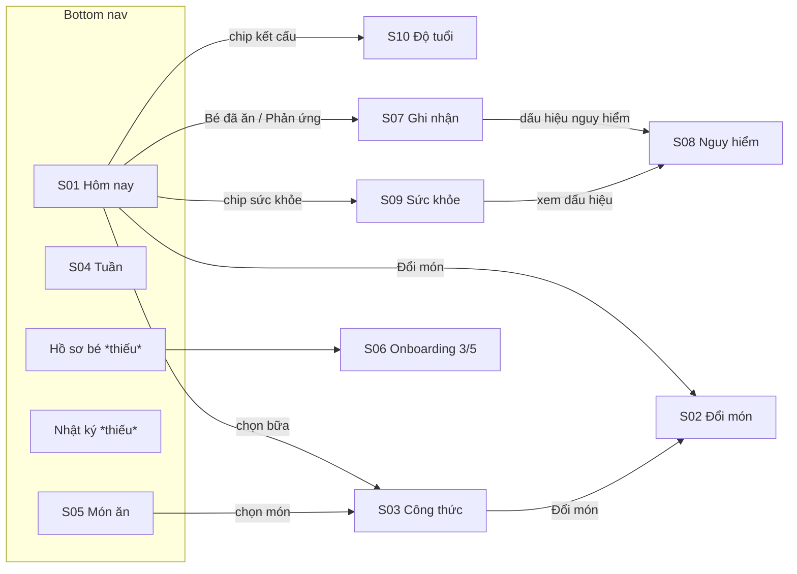
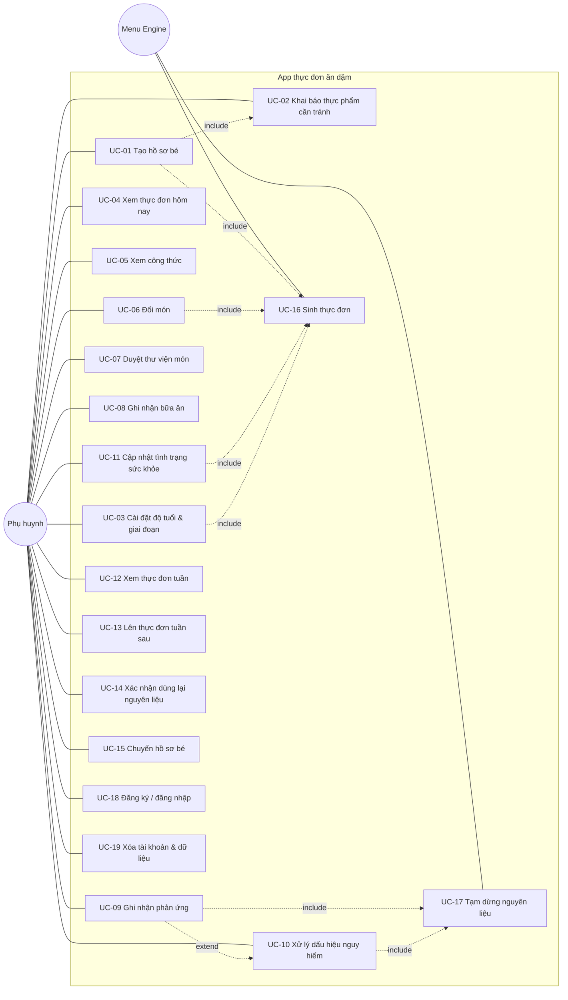
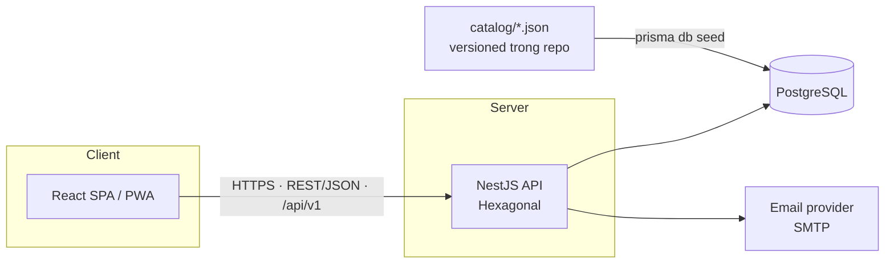
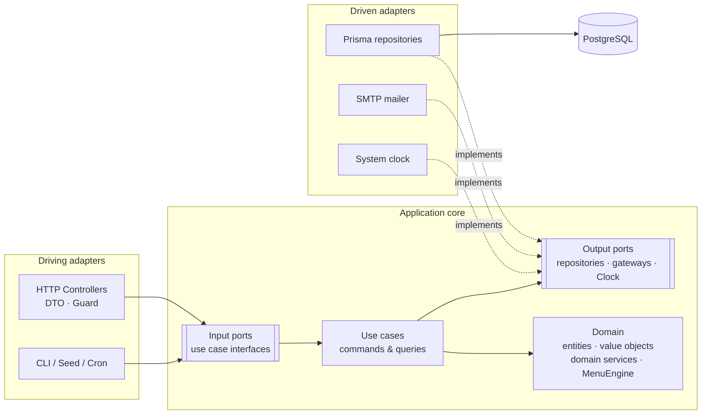
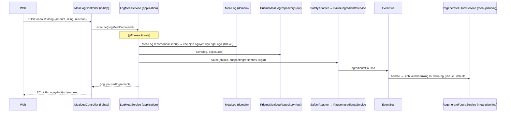
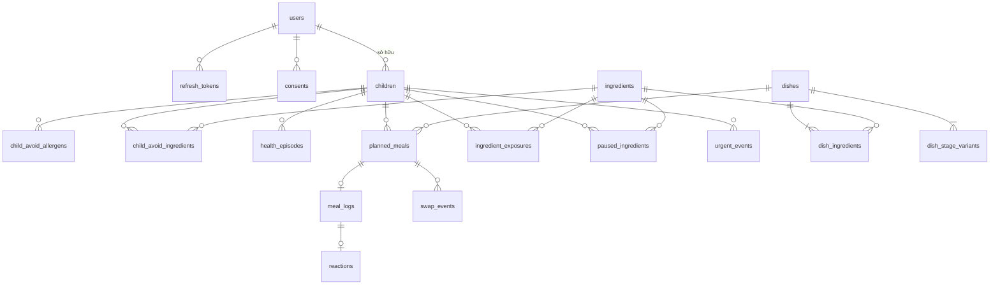

# Phân tích hệ thống — App thực đơn ăn dặm

| Mục | Nội dung |
|---|---|
| Nguồn phân tích | `App thực đơn ăn dặm.html` (bản export thiết kế, 10 màn hình mobile 390px) |
| Phiên bản tài liệu | v0.3 — 07/10/2026 |
| Phạm vi | Toàn bộ tính năng suy ra từ UI + các giả định cần thiết để hệ thống chạy được |
| Stack đã chốt | Frontend **ReactJS** · Backend **NestJS** · Database **PostgreSQL** |
| Tài liệu liên quan | [02-ke-hoach-trien-khai.md](02-ke-hoach-trien-khai.md) |

**Lịch sử thay đổi**

| Phiên bản | Thay đổi |
|---|---|
| v0.1 | Bản đầu, kiến trúc local-first (không backend). |
| v0.2 | Chốt stack React + NestJS + PostgreSQL → kiến trúc client–server; thêm tài khoản/đăng nhập & đồng ý xử lý dữ liệu vào MVP; menu engine chuyển về backend; thêm đặc tả API, schema PostgreSQL, bảo mật; cập nhật NFR và ràng buộc. |
| v0.3 | P4: BR-28/29 dùng nguyên liệu chính (`isMain`) của món; tìm món ưu tiên từ nguyên vẹn và dấu tiếng Việt; chốt dạng response đổi món/thư viện và mã lỗi mới. Chốt Q3 khi làm P3: “nguyên liệu mới” chỉ tính đạm/rau củ/trái cây chưa ăn; BR-24/25 chỉ ràng buộc nguyên liệu mới **có tag dị ứng**. |

> Các mục đánh dấu **[Giả định]** là suy luận không có trực tiếp trên UI, cần xác nhận (tổng hợp ở mục 10).

---

## 1. Tổng quan sản phẩm

### 1.1 Mục tiêu

Ứng dụng giúp cha mẹ lên **thực đơn ăn dặm hằng ngày/tuần** cho bé 6–24 tháng, tự động theo **độ tuổi, giai đoạn ăn dặm, thực phẩm cần tránh và tình trạng sức khỏe**, đồng thời **ghi nhận bữa ăn và phản ứng** để giữ an toàn khi bé thử thực phẩm mới.

### 1.2 Người dùng

| Vai trò | Mô tả |
|---|---|
| Phụ huynh (người chăm bé) | Người dùng chính: tạo hồ sơ bé, xem/đổi thực đơn, nấu theo công thức, ghi nhận bữa ăn và phản ứng. |
| Hệ thống (Menu Engine) | Tác nhân tự động: lập thực đơn, lọc an toàn, xoay vòng món, tạm dừng nguyên liệu nghi gây phản ứng. |
| Người biên soạn nội dung **[Giả định]** | Chuyên gia dinh dưỡng duyệt công thức (UI hiển thị “Đã duyệt nội dung · Công thức v3”). Chưa có màn hình, ngoài phạm vi MVP. |

### 1.3 Nguyên tắc sản phẩm (rút ra từ UI copy)

1. **An toàn trên hết** — bộ lọc an toàn (dị ứng, nguyên liệu tạm dừng, độ tuổi) **không bao giờ được nới**, kể cả khi kho món ít.
2. **Không chẩn đoán** — app không kết luận nguyên nhân, không thay thế tư vấn y tế; luôn có disclaimer và lối tắt tới “Dấu hiệu nguy hiểm / Gọi 115”.
3. **Không phán xét** — chỉ số tuần là “gợi ý cân nhắc, không phải điểm đánh giá việc chăm bé”.
4. **Minh bạch lý do** — mỗi gợi ý đổi món có giải thích (vì sao phù hợp, vì sao bị loại).

---

## 2. Danh mục màn hình

### 2.1 Các màn hình có trong thiết kế

| # | Màn hình | Route đề xuất | Mục đích | Thành phần chính |
|---|---|---|---|---|
| S01 | Hôm nay | `/` | Dashboard ngày | Header hồ sơ bé (avatar, ngày, tuổi, giai đoạn, nút đổi hồ sơ); chip trạng thái (kết cấu, sức khỏe, thực phẩm tránh); card **Bữa tiếp theo** (giờ, đếm ngược, thời gian nấu, kết cấu, khẩu phần, 4 nhóm chất, cảnh báo “lần đầu thử”); nút *Đã chuẩn bị xong / Đổi món / Bé đã ăn / Phản ứng*; danh sách bữa trong ngày; disclaimer; bottom nav. |
| S02 | Đổi món | `/meals/:mealId/swap` | Thay món cho 1 bữa | Lý do đổi (4 lựa chọn, single-select); danh sách gợi ý thay thế (1 món “Phù hợp nhất” kèm lý do, các món khác); ghi chú nới cửa sổ chống lặp; tóm tắt số món bị loại theo lý do. |
| S03 | Công thức | `/dishes/:dishId` | Xem công thức | Ảnh; nhãn duyệt + version; mô tả; sơ chế/nấu/kết cấu/dụng cụ; tab theo độ tuổi (6–7, 8–9, 10–12 tháng) → kết cấu + khẩu phần; nguyên liệu cho 1 phần (định lượng, nhóm chất, cờ “lần đầu”); lưu ý an toàn; các bước; nút *Đổi món / Bắt đầu nấu*. |
| S04 | Thực đơn tuần | `/week` | Tổng quan tuần | Điều hướng tuần trước/sau; chỉ số “Món khác nhau x/28 bữa”, “Ngày đạt 4 nhóm x/7”; biểu đồ **xoay vòng nguồn đạm** (Cá, Gà, Bò, Heo, Đậu, Trứng — trứng hiển thị 0 “đang tránh”); danh sách 7 ngày (tóm tắt món, điểm nhóm chất, trạng thái “kế hoạch”, nhãn “mới”); *Danh sách đi chợ / Lên thực đơn tuần sau*. |
| S05 | Món ăn | `/dishes` | Thư viện món | Mô tả bộ lọc đang áp dụng; ô tìm món/nguyên liệu; chip lọc (Tất cả, Gà, Cá, Bò, Heo, Đậu, Bữa phụ); đếm số món; switch “Chưa ăn 7 ngày”; card món (tên, meta, nhóm, tag *Lần đầu / Bé thích / Ăn gần đây*); empty state; khối “Đang ẩn N món không phù hợp” + lý do. |
| S06 | Tạo hồ sơ · Thực phẩm cần tránh | `/onboarding/3` | Bước 3/5 onboarding | 9 chất gây dị ứng thường gặp (multi-select); tìm & thêm thực phẩm khác bé không ăn/không thích (chip xóa được); câu hỏi “đã từng có phản ứng?” (Chưa từng / Có — ghi chi tiết / Không chắc); *Tiếp tục*; disclaimer. |
| S07 | Ghi nhận bữa ăn & phản ứng | `/meals/:mealId/log` | Log bữa ăn | Giờ ghi nhận; lượng ăn (6 mức); mức thích 1–5; dấu hiệu bất thường (6 triệu chứng, multi-select); mức độ (4 mức); ghi chú; thông báo tạm dừng nguyên liệu; *Lưu ghi nhận*; link *Bé có dấu hiệu nguy hiểm*. |
| S08 | Dấu hiệu nguy hiểm | `/urgent` | Hướng dẫn khẩn cấp | 4 dấu hiệu nguy hiểm; *Gọi 115* (`tel:115`); *Tôi đã liên hệ nhân viên y tế*; thông báo đã tạm dừng các nguyên liệu liên quan; disclaimer. |
| S09 | Tình trạng sức khỏe | `/health` | Cập nhật sức khỏe | Trạng thái (Bình thường / Đang ốm / Đang hồi phục); biểu hiện (6, multi-select); ngày bắt đầu / dự kiến kết thúc; xem trước “thực đơn sẽ thay đổi”; link dấu hiệu nguy hiểm; *Cập nhật thực đơn*. |
| S10 | Cài đặt độ tuổi | `/settings/age` | Tuổi & giai đoạn | Ngày sinh; tuổi dùng lập thực đơn; switch bé sinh non + số tuần sinh sớm (tuổi hiệu chỉnh); chọn giai đoạn (4 giai đoạn: theo tuổi / đã mở / bị khóa); “Về theo tuổi”; xem trước thực đơn áp dụng (kết cấu, khẩu phần, bữa chính, bữa phụ); *Lưu và cập nhật thực đơn*. |

Bottom navigation (S01, S04, S05): **Hôm nay · Tuần · Món ăn · Nhật ký · Hồ sơ bé**.

### 2.2 Sơ đồ điều hướng



### 2.3 Màn hình / luồng còn thiếu trong thiết kế (gap)

| # | Thiếu | Lý do cần | Đề xuất |
|---|---|---|---|
| G01 | Onboarding bước 1, 2, 4, 5 | S06 là “3/5” | B1: tên/giới tính/avatar; B2: ngày sinh + sinh non (tái dùng S10); B4: chi tiết phản ứng trước đây (nếu chọn “Có”); B5: tóm tắt + giờ bữa ăn → tạo thực đơn. **[Giả định]** |
| G02 | Tab **Nhật ký** | Có trên bottom nav, chưa có màn | Timeline các bữa đã ghi nhận + phản ứng, lọc theo ngày; xem chi tiết để đưa bác sĩ. |
| G03 | Tab **Hồ sơ bé** | Nav trỏ về Onboarding | Trang tổng quan hồ sơ: thông tin, thực phẩm tránh, nguyên liệu tạm dừng, lối vào S09/S10, quản lý nhiều bé. |
| G04 | Chọn hồ sơ bé khác | Nút ⌄ trên S01 | Bottom sheet danh sách bé + “Thêm bé”. |
| G05 | Danh sách đi chợ | Nút trên S04 | Tổng hợp nguyên liệu theo tuần, gộp định lượng, tick đã mua. |
| G06 | Lên thực đơn tuần sau | Nút trên S04 | Sinh kế hoạch tuần kế tiếp + xem trước. |
| G07 | Chế độ nấu (Bắt đầu nấu) | Nút trên S03 | Từng bước toàn màn hình, giữ màn hình sáng, hẹn giờ. |
| G08 | Xác nhận lại nguyên liệu tạm dừng | S07/S08 nói “cho đến khi bạn xác nhận lại” | Danh sách nguyên liệu tạm dừng + nút “Bác sĩ đã cho phép dùng lại”. |
| G09 | Chi tiết ngày trong tuần | Dòng ngày trên S04 | Tái dùng danh sách bữa của S01 cho ngày bất kỳ. |
| G10 | Đăng ký / Đăng nhập / Quên mật khẩu | Có backend → dữ liệu gắn với tài khoản | 3 màn đơn giản theo design system hiện có. |
| G11 | Đồng ý xử lý dữ liệu | Lưu dữ liệu sức khỏe trẻ em trên server (NĐ 13/2023) | Hiển thị khi đăng ký: tóm tắt dữ liệu thu thập, mục đích, checkbox đồng ý bắt buộc, link chính sách. |
| G12 | Cài đặt tài khoản | Đăng xuất, đổi mật khẩu, xóa tài khoản | Truy cập từ trang Hồ sơ bé. |

---

## 3. Danh sách tính năng

| ID | Nhóm tính năng | Mô tả | Màn hình | MVP |
|---|---|---|---|---|
| F01 | Hồ sơ bé & Onboarding | Tạo hồ sơ 5 bước, thực phẩm cần tránh, lịch sử phản ứng, nhiều bé | S06, G01, G03, G04 | ✅ (1 bé) |
| F02 | Độ tuổi & Giai đoạn | Tính tuổi thật/hiệu chỉnh, map giai đoạn, cho phép giữ giai đoạn thấp hơn | S10 | ✅ |
| F03 | Thực đơn hôm nay | Sinh thực đơn ngày, bữa tiếp theo, đếm ngược, trạng thái bữa | S01 | ✅ |
| F04 | Công thức món | Chi tiết công thức theo độ tuổi, nguyên liệu, lưu ý an toàn | S03 | ✅ |
| F05 | Đổi món thông minh | Gợi ý thay thế theo lý do, xếp hạng, giải thích, chống lặp | S02 | ✅ |
| F06 | Thư viện món | Tìm, lọc theo nguồn đạm, lọc chưa ăn 7 ngày, món bị ẩn | S05 | ✅ |
| F07 | Ghi nhận bữa ăn & phản ứng | Lượng ăn, mức thích, triệu chứng, mức độ, ghi chú | S07 | ✅ |
| F08 | An toàn & khẩn cấp | Dấu hiệu nguy hiểm, gọi 115, tự động tạm dừng nguyên liệu | S08, G08 | ✅ |
| F09 | Tình trạng sức khỏe | Ốm / hồi phục → điều chỉnh bữa, kết cấu, dừng thử món mới | S09 | ✅ |
| F10 | Thực đơn tuần & chỉ số | Kế hoạch 7 ngày, chỉ số đa dạng, xoay vòng đạm | S04, G06, G09 | ✅ |
| F11 | Nhật ký | Timeline ghi nhận, xuất cho bác sĩ | G02 | ⚠️ bản tối giản |
| F12 | Danh sách đi chợ | Tổng hợp nguyên liệu tuần | G05 | ❌ sau MVP |
| F13 | Chế độ nấu | Hướng dẫn từng bước, hẹn giờ | G07 | ❌ sau MVP |
| F14 | Nhắc nhở / thông báo | Nhắc giờ ăn, nhắc theo dõi sau món mới | — | ❌ sau MVP |
| F15 | Tài khoản & dữ liệu cá nhân | Đăng ký, đăng nhập, đồng ý xử lý dữ liệu, xóa tài khoản; dữ liệu tự có trên mọi thiết bị | G10, G11, G12 | ✅ |
| F16 | Quản trị nội dung (CMS) | Biên soạn, duyệt, version công thức | — | ❌ sau MVP |
| F17 | Nhiều người chăm | Mời ông bà/người giúp việc cùng xem & ghi nhận cho 1 bé | — | ❌ sau MVP |

---

## 4. Use case

### 4.1 Sơ đồ use case



### 4.2 Danh sách use case

| ID | Tên | Tác nhân | Màn hình | MVP |
|---|---|---|---|---|
| UC-01 | Tạo hồ sơ bé | Phụ huynh | G01, S06 | ✅ |
| UC-02 | Khai báo thực phẩm cần tránh | Phụ huynh | S06 | ✅ |
| UC-03 | Cài đặt độ tuổi & giai đoạn | Phụ huynh | S10 | ✅ |
| UC-04 | Xem thực đơn hôm nay | Phụ huynh | S01 | ✅ |
| UC-05 | Xem công thức | Phụ huynh | S03 | ✅ |
| UC-06 | Đổi món | Phụ huynh | S02 | ✅ |
| UC-07 | Duyệt thư viện món | Phụ huynh | S05 | ✅ |
| UC-08 | Ghi nhận bữa ăn | Phụ huynh | S07 | ✅ |
| UC-09 | Ghi nhận phản ứng | Phụ huynh | S07 | ✅ |
| UC-10 | Xử lý dấu hiệu nguy hiểm | Phụ huynh | S08 | ✅ |
| UC-11 | Cập nhật tình trạng sức khỏe | Phụ huynh | S09 | ✅ |
| UC-12 | Xem thực đơn tuần | Phụ huynh | S04 | ✅ |
| UC-13 | Lên thực đơn tuần sau | Phụ huynh | S04, G06 | ✅ |
| UC-14 | Xác nhận dùng lại nguyên liệu tạm dừng | Phụ huynh | G08 | ✅ |
| UC-15 | Chuyển / thêm hồ sơ bé | Phụ huynh | G04 | ❌ |
| UC-16 | Sinh thực đơn (ngày/tuần/thay thế) | Menu Engine | — | ✅ |
| UC-17 | Tạm dừng nguyên liệu nghi gây phản ứng | Menu Engine | — | ✅ |
| UC-18 | Đăng ký / đăng nhập | Phụ huynh | G10, G11 | ✅ |
| UC-19 | Xóa tài khoản & dữ liệu | Phụ huynh | G12 | ✅ |

### 4.3 Đặc tả use case chính

#### UC-18 Đăng ký / đăng nhập
- **Luồng chính (đăng ký):** Nhập email + mật khẩu (≥ 8 ký tự) → đọc tóm tắt xử lý dữ liệu và tích đồng ý (G11) → hệ thống tạo tài khoản, lưu phiên bản đồng ý + thời điểm → chuyển tới onboarding UC-01.
- **Luồng chính (đăng nhập):** Nhập email + mật khẩu → nhận phiên đăng nhập → có hồ sơ bé thì vào S01, chưa có thì vào onboarding.
- **Luồng thay thế:** Sai thông tin → thông báo chung “Email hoặc mật khẩu không đúng”; nhập sai 5 lần/15 phút → tạm khóa đăng nhập 15 phút. Quên mật khẩu → gửi link đặt lại qua email (hết hạn sau 30 phút).
- **Hậu điều kiện:** Phiên đăng nhập duy trì 30 ngày trên thiết bị (refresh token).

#### UC-19 Xóa tài khoản & dữ liệu
- **Luồng chính:** Cài đặt tài khoản → Xóa tài khoản → nhập lại mật khẩu → xác nhận → hệ thống đăng xuất mọi thiết bị, dữ liệu không truy cập được ngay, xóa vĩnh viễn trong ≤ 30 ngày.

#### UC-01 Tạo hồ sơ bé
- **Tiền điều kiện:** Đã đăng nhập (UC-18); chưa có hồ sơ bé nào hoặc người dùng chọn “Thêm bé”.
- **Luồng chính:**
  1. Người dùng nhập tên bé (B1).
  2. Nhập ngày sinh; bật “Bé sinh non” nếu cần và nhập số tuần sinh sớm (B2).
  3. Chọn chất gây dị ứng / thực phẩm cần tránh (B3 — UC-02).
  4. Nếu chọn “Có phản ứng trước đây” → nhập chi tiết (B4).
  5. Xem tóm tắt, xác nhận (B5). Hệ thống lưu hồ sơ, gọi UC-16 sinh thực đơn tuần hiện tại, chuyển tới S01.
- **Luồng thay thế:**
  - 2a. Tuổi (thật hoặc hiệu chỉnh) < 6 tháng → hiển thị thông báo “ứng dụng không lập thực đơn ăn dặm dưới 6 tháng”; vẫn lưu hồ sơ, không sinh thực đơn.
  - 2b. Tuổi > 24 tháng → thông báo ngoài phạm vi hỗ trợ **[Giả định]**.
  - *. Nút Quay lại giữ dữ liệu đã nhập ở các bước trước.
- **Hậu điều kiện:** Hồ sơ bé được lưu và trở thành hồ sơ đang chọn.

#### UC-02 Khai báo thực phẩm cần tránh
- **Luồng chính:** Người dùng bật/tắt các chip dị ứng (Trứng, Sữa bò, Đậu phộng, Tôm cua, Cá, Lúa mì, Đậu nành, Mè, Hạt cây); tìm nguyên liệu và thêm vào danh sách “không ăn / không thích”; xóa chip bằng nút ×.
- **Luồng thay thế:** Tìm không thấy nguyên liệu → hiển thị “Không tìm thấy” (MVP không cho nhập tự do **[Giả định]**).
- **Quy tắc:** BR-01, BR-02.
- **Hậu điều kiện:** Mọi món chứa các thực phẩm này bị loại khỏi thực đơn, thư viện, gợi ý đổi món.

#### UC-03 Cài đặt độ tuổi & giai đoạn
- **Luồng chính:**
  1. Hệ thống hiển thị ngày sinh, tuổi dùng lập thực đơn, giai đoạn theo tuổi (đánh dấu “Theo tuổi”).
  2. Người dùng có thể bật sinh non → tuổi hiệu chỉnh được tính lại, giai đoạn theo tuổi cập nhật, lựa chọn thủ công bị reset.
  3. Người dùng có thể chọn giai đoạn **thấp hơn** giai đoạn theo tuổi → hiển thị cảnh báo “đang giữ giai đoạn sớm hơn tuổi” và nút “Về theo tuổi”.
  4. Khối “Thực đơn sẽ áp dụng” cập nhật theo giai đoạn đang chọn.
  5. Nhấn *Lưu và cập nhật thực đơn* → lưu, gọi UC-16 cho các bữa **chưa diễn ra**.
- **Luồng thay thế:** Giai đoạn cao hơn tuổi hiển thị khóa “Mở khi bé đủ X tháng”, không chọn được (BR-11).

#### UC-04 Xem thực đơn hôm nay
- **Luồng chính:**
  1. Hệ thống lấy kế hoạch ngày hôm nay của bé đang chọn (nếu chưa có → UC-16).
  2. Xác định **bữa tiếp theo** (BR-30) và hiển thị card: tên món, giờ, đếm ngược, thời gian nấu, kết cấu, khẩu phần, nhóm chất đạt được, cảnh báo nguyên liệu lần đầu.
  3. Danh sách bữa trong ngày với trạng thái: đã ăn (lượng + mức thích), tiếp theo, kế hoạch.
- **Hành động:** *Đã chuẩn bị xong* → bữa chuyển trạng thái `prepared`; *Đổi món* → UC-06; *Bé đã ăn* → UC-08; *Phản ứng* → UC-09 (S07 mở sẵn phần phản ứng); chạm bữa → UC-05; chip kết cấu → S10; chip sức khỏe → S09.
- **Luồng thay thế:** Mọi bữa đã ghi nhận → card hiển thị “Hôm nay đã xong” + gợi ý xem ngày mai **[Giả định]**.

#### UC-06 Đổi món
- **Tiền điều kiện:** Bữa chưa được ghi nhận “đã ăn”.
- **Luồng chính:**
  1. Người dùng chọn lý do (mặc định “Thiếu nguyên liệu”).
  2. Hệ thống (UC-16, chế độ thay thế) trả về danh sách ứng viên đã xếp hạng; ứng viên #1 gắn nhãn “Phù hợp nhất” kèm tối đa 3 lý do.
  3. Hiển thị tóm tắt số món đã loại theo từng lý do an toàn.
  4. Người dùng nhấn *Chọn* → bữa được thay món, quay về màn trước, lưu lịch sử đổi (lý do).
- **Luồng thay thế:**
  - 2a. Không đủ ứng viên với cửa sổ chống lặp 7 ngày → nới xuống 3 ngày và hiển thị ghi chú giải thích (BR-21).
  - 2b. Vẫn không có ứng viên → empty state “Chưa có món phù hợp”, gợi ý mở Thư viện món.
  - 1a. Đổi lý do → danh sách xếp hạng lại ngay.

#### UC-08 / UC-09 Ghi nhận bữa ăn & phản ứng
- **Luồng chính:**
  1. Hệ thống điền sẵn bữa + giờ hiện tại.
  2. Người dùng chọn lượng ăn (6 mức) và mức thích (1–5).
  3. (UC-09) Nếu có dấu hiệu bất thường → chọn triệu chứng, mức độ, ghi chú.
  4. *Lưu ghi nhận* → lưu log, bữa chuyển `eaten` (hoặc `refused` nếu “Không ăn”).
  5. Nếu có ít nhất 1 triệu chứng → UC-17 tạm dừng nguyên liệu (BR-40); thông báo rõ nguyên liệu nào bị tạm dừng.
- **Luồng thay thế:**
  - 3a. Người dùng nhấn *Bé có dấu hiệu nguy hiểm* → UC-10 (dữ liệu đang nhập được giữ lại dưới dạng nháp).
  - 3b. Chọn “Khó thở” hoặc “Sưng môi, mặt” hoặc mức độ “Nặng” → hệ thống hiện banner đỏ gợi ý mở S08 ngay **[Giả định]**.
- **Hậu điều kiện:** Log dùng cho: tag “Bé thích”, loại món bị từ chối, cờ “lần đầu”, chỉ số tuần, nhật ký.

#### UC-10 Xử lý dấu hiệu nguy hiểm
- **Luồng chính:**
  1. Hiển thị 4 dấu hiệu cần gọi cấp cứu, nút *Gọi 115*.
  2. Hệ thống tự động tạm dừng các nguyên liệu liên quan tới bữa gần nhất (BR-41) và hiển thị danh sách.
  3. Người dùng nhấn *Tôi đã liên hệ nhân viên y tế* → ghi nhận sự kiện khẩn cấp có timestamp vào nhật ký.
- **Hậu điều kiện:** Nguyên liệu bị tạm dừng tới khi UC-14.

#### UC-11 Cập nhật tình trạng sức khỏe
- **Luồng chính:** Chọn trạng thái → chọn biểu hiện → ngày bắt đầu (mặc định hôm nay) / dự kiến kết thúc (tùy chọn) → xem trước thay đổi → *Cập nhật thực đơn* → UC-16 cho các bữa chưa diễn ra (BR-50..53).
- **Luồng thay thế:** Tới ngày dự kiến kết thúc → hệ thống hỏi chuyển sang “Đang hồi phục” / “Bình thường” **[Giả định]**.

#### UC-12 / UC-13 Thực đơn tuần
- **UC-12:** Xem tuần hiện tại (T2–CN), chuyển tuần trước/sau; chỉ số tính theo BR-60..62; chạm ngày → xem chi tiết ngày (G09).
- **UC-13:** *Lên thực đơn tuần sau* → UC-16 sinh 7 ngày tiếp theo; nếu đã có kế hoạch → hỏi ghi đè các bữa chưa ghi nhận.

#### UC-16 Sinh thực đơn (Menu Engine)
Đặc tả thuật toán ở mục 7.5.

#### UC-17 Tạm dừng nguyên liệu
- **Kích hoạt:** UC-09 (có triệu chứng) hoặc UC-10.
- **Xử lý:** Thêm nguyên liệu vào danh sách `paused` của bé kèm lý do + liên kết log; sinh lại các bữa tương lai đang chứa nguyên liệu đó.

---

## 5. Yêu cầu chức năng (Functional Requirements)

Định dạng: *Là [vai trò], tôi muốn [mục tiêu] để [lợi ích].* Vai trò: **PH** = phụ huynh, **HT** = hệ thống.

### 5.1 Hồ sơ bé & độ tuổi (F01, F02)

| ID | Tiêu đề | User story | Ưu tiên | Trạng thái |
|---|---|---|---|---|
| FR-001 | Tạo hồ sơ | Là PH, tôi muốn tạo hồ sơ bé qua 5 bước để app lập thực đơn đúng với bé. | High | Open |
| FR-002 | Chọn chất dị ứng | Là PH, tôi muốn chọn các chất gây dị ứng thường gặp cần tránh để thực đơn không bao giờ chứa chúng. | High | Open |
| FR-003 | Thực phẩm không ăn | Là PH, tôi muốn tìm và thêm nguyên liệu bé không ăn/không thích để app không gợi ý món chứa nguyên liệu đó. | High | Open |
| FR-004 | Lịch sử phản ứng | Là PH, tôi muốn khai báo bé đã từng có phản ứng (Chưa từng/Có/Không chắc) để app thận trọng hơn khi giới thiệu món mới. | Medium | Open |
| FR-005 | Ngày sinh & tuổi | Là PH, tôi muốn nhập ngày sinh để app tự tính tuổi bé theo tháng và ngày. | High | Open |
| FR-006 | Tuổi hiệu chỉnh | Là PH có bé sinh non, tôi muốn nhập số tuần sinh sớm để app dùng tuổi hiệu chỉnh khi lập thực đơn. | High | Open |
| FR-007 | Giai đoạn theo tuổi | Là PH, tôi muốn app tự chọn giai đoạn ăn dặm theo tuổi để không phải tự tra cứu. | High | Open |
| FR-008 | Giữ giai đoạn sớm hơn | Là PH, tôi muốn chọn giai đoạn thấp hơn tuổi để bé làm quen dần khi chưa quen kết cấu mới. | Medium | Open |
| FR-009 | Chặn giai đoạn cao hơn | Là PH, tôi muốn thấy giai đoạn cao hơn bị khóa kèm mốc mở khóa để không cho bé ăn kết cấu quá sớm. | High | Open |
| FR-010 | Xem trước áp dụng | Là PH, tôi muốn xem trước kết cấu, khẩu phần, số bữa chính/phụ của giai đoạn đang chọn để hiểu thay đổi trước khi lưu. | Medium | Open |
| FR-011 | Dưới 6 tháng | Là PH có bé dưới 6 tháng, tôi muốn được thông báo app không lập thực đơn để tránh cho bé ăn dặm quá sớm. | High | Open |
| FR-012 | Nhiều hồ sơ | Là PH có nhiều con, tôi muốn chuyển giữa các hồ sơ bé để quản lý thực đơn riêng từng bé. | Low | Deferred |
| FR-013 | Trang hồ sơ | Là PH, tôi muốn xem và sửa thông tin hồ sơ, thực phẩm cần tránh sau khi onboarding để cập nhật khi bé thay đổi. | High | Open |

### 5.2 Thực đơn hôm nay & công thức (F03, F04)

| ID | Tiêu đề | User story | Ưu tiên | Trạng thái |
|---|---|---|---|---|
| FR-020 | Thực đơn ngày | Là PH, tôi muốn thấy danh sách bữa hôm nay (giờ, tên buổi, món) để biết bé ăn gì cả ngày. | High | Open |
| FR-021 | Bữa tiếp theo | Là PH, tôi muốn thấy nổi bật bữa tiếp theo kèm thời gian còn lại để chuẩn bị kịp giờ. | High | Open |
| FR-022 | Thông tin bữa | Là PH, tôi muốn thấy thời gian nấu, kết cấu, khẩu phần tham khảo của bữa để nấu đúng. | High | Open |
| FR-023 | Nhóm chất | Là PH, tôi muốn thấy món đạt bao nhiêu trong 4 nhóm chất (tinh bột, đạm, chất béo, rau củ) để đảm bảo cân bằng. | High | Open |
| FR-024 | Cảnh báo lần đầu | Là PH, tôi muốn được cảnh báo khi bữa có nguyên liệu bé lần đầu thử để cho lượng nhỏ và theo dõi. | High | Open |
| FR-025 | Đánh dấu đã chuẩn bị | Là PH, tôi muốn đánh dấu bữa đã chuẩn bị xong để theo dõi tiến độ trong ngày. | Low | Open |
| FR-026 | Chip trạng thái | Là PH, tôi muốn thấy nhanh kết cấu, tình trạng sức khỏe, thực phẩm đang tránh ở đầu trang để biết thực đơn đang được điều chỉnh theo gì. | Medium | Open |
| FR-027 | Chi tiết công thức | Là PH, tôi muốn xem mô tả, thời gian sơ chế/nấu, kết cấu, dụng cụ, nguyên liệu cho 1 phần và các bước để nấu theo. | High | Open |
| FR-028 | Công thức theo tuổi | Là PH, tôi muốn chuyển tab theo độ tuổi để xem kết cấu và khẩu phần phù hợp từng giai đoạn. | Medium | Open |
| FR-029 | Lưu ý an toàn | Là PH, tôi muốn thấy lưu ý an toàn (chất gây dị ứng, hóc xương, không nêm muối/đường dưới 1 tuổi) để nấu an toàn. | High | Open |
| FR-030 | Nhãn duyệt nội dung | Là PH, tôi muốn thấy công thức đã được duyệt và phiên bản để tin tưởng nội dung. | Low | Open |
| FR-031 | Chế độ nấu | Là PH, tôi muốn mở chế độ nấu từng bước để vừa nấu vừa xem. | Low | Deferred |
| FR-032 | Disclaimer | Là PH, tôi muốn thấy ghi chú thực đơn chỉ mang tính tham khảo để hiểu giới hạn của app. | High | Open |

### 5.3 Đổi món & thư viện (F05, F06)

| ID | Tiêu đề | User story | Ưu tiên | Trạng thái |
|---|---|---|---|---|
| FR-040 | Lý do đổi | Là PH, tôi muốn chọn lý do đổi món (thiếu nguyên liệu, bé không thích, cần nhanh hơn, khác) để gợi ý sát nhu cầu. | High | Open |
| FR-041 | Gợi ý thay thế | Là PH, tôi muốn nhận danh sách món thay thế đã xếp hạng để chọn nhanh. | High | Open |
| FR-042 | Giải thích gợi ý | Là PH, tôi muốn thấy lý do món được đề xuất “phù hợp nhất” để tin tưởng lựa chọn. | Medium | Open |
| FR-043 | Minh bạch món bị loại | Là PH, tôi muốn biết bao nhiêu món bị loại và vì sao để hiểu bộ lọc an toàn đang hoạt động. | Medium | Open |
| FR-044 | Nới chống lặp | Là PH, tôi muốn app thông báo khi phải nới cửa sổ chống lặp để hiểu vì sao món được lặp lại. | Medium | Open |
| FR-045 | Áp dụng đổi món | Là PH, tôi muốn chọn 1 món thay thế và thấy thực đơn cập nhật ngay để tiếp tục chuẩn bị. | High | Open |
| FR-046 | Tìm món | Là PH, tôi muốn tìm món theo tên hoặc nguyên liệu để tận dụng nguyên liệu sẵn có. | High | Open |
| FR-047 | Lọc nguồn đạm | Là PH, tôi muốn lọc món theo Gà, Cá, Bò, Heo, Đậu, Bữa phụ để chọn theo nhu cầu. | Medium | Open |
| FR-048 | Lọc chưa ăn 7 ngày | Là PH, tôi muốn chỉ xem món bé chưa ăn trong 7 ngày để đa dạng thực đơn. | Medium | Open |
| FR-049 | Tag món | Là PH, tôi muốn thấy tag “Lần đầu”, “Bé thích”, “Ăn N ngày trước” trên từng món để quyết định nhanh. | Medium | Open |
| FR-050 | Món đang ẩn | Là PH, tôi muốn thấy số món đang bị ẩn và lý do để biết thư viện đã được lọc theo hồ sơ. | Medium | Open |
| FR-051 | Empty state | Là PH, tôi muốn được gợi ý bỏ bớt bộ lọc khi không có kết quả để không bị kẹt. | Low | Open |

### 5.4 Ghi nhận, phản ứng, an toàn (F07, F08)

| ID | Tiêu đề | User story | Ưu tiên | Trạng thái |
|---|---|---|---|---|
| FR-060 | Lượng ăn | Là PH, tôi muốn ghi lượng bé ăn (Không ăn … Hết) để theo dõi khả năng ăn. | High | Open |
| FR-061 | Mức thích | Là PH, tôi muốn chấm mức thích 1–5 để app ưu tiên món bé thích. | High | Open |
| FR-062 | Triệu chứng | Là PH, tôi muốn ghi dấu hiệu bất thường (mẩn đỏ, nôn trớ, tiêu chảy, sưng môi mặt, khó thở, quấy khóc) để theo dõi phản ứng. | High | Open |
| FR-063 | Mức độ & ghi chú | Là PH, tôi muốn ghi mức độ và ghi chú tự do để mô tả chính xác cho bác sĩ. | High | Open |
| FR-064 | Tự tạm dừng nguyên liệu | Là PH, tôi muốn app tự tạm dừng nguyên liệu nghi ngờ sau khi ghi phản ứng để bé không bị ăn lại. | High | Open |
| FR-065 | Dấu hiệu nguy hiểm | Là PH, tôi muốn mở nhanh danh sách dấu hiệu nguy hiểm để quyết định gọi cấp cứu. | High | Open |
| FR-066 | Gọi 115 | Là PH, tôi muốn gọi 115 bằng 1 chạm để không mất thời gian. | High | Open |
| FR-067 | Xác nhận đã liên hệ y tế | Là PH, tôi muốn đánh dấu đã liên hệ nhân viên y tế để lưu mốc thời gian cho bác sĩ. | Medium | Open |
| FR-068 | Dùng lại nguyên liệu | Là PH, tôi muốn xác nhận cho dùng lại nguyên liệu tạm dừng sau khi hỏi bác sĩ để thực đơn trở lại bình thường. | High | Open |
| FR-069 | Nhật ký | Là PH, tôi muốn xem lại lịch sử bữa ăn và phản ứng theo ngày để đưa bác sĩ xem. | Medium | Open |
| FR-070 | Xuất nhật ký | Là PH, tôi muốn xuất nhật ký phản ứng (PDF/ảnh) để gửi bác sĩ. | Low | Deferred |

### 5.5 Sức khỏe (F09)

| ID | Tiêu đề | User story | Ưu tiên | Trạng thái |
|---|---|---|---|---|
| FR-080 | Trạng thái sức khỏe | Là PH, tôi muốn đặt trạng thái Bình thường / Đang ốm / Đang hồi phục để thực đơn điều chỉnh theo. | High | Open |
| FR-081 | Biểu hiện | Là PH, tôi muốn chọn các biểu hiện (sốt, biếng ăn, ho, tiêu chảy, nôn, mọc răng) để lưu lại diễn biến. | Medium | Open |
| FR-082 | Thời gian ốm | Là PH, tôi muốn nhập ngày bắt đầu và dự kiến kết thúc để app biết khi nào trở lại bình thường. | Medium | Open |
| FR-083 | Xem trước thay đổi | Là PH, tôi muốn xem trước các thay đổi thực đơn trước khi áp dụng để yên tâm. | Medium | Open |
| FR-084 | Áp dụng điều chỉnh | Là PH, tôi muốn thực đơn các bữa chưa diễn ra được sinh lại theo trạng thái sức khỏe để bé ăn dễ hơn khi ốm. | High | Open |

### 5.6 Thực đơn tuần (F10) & sau MVP

| ID | Tiêu đề | User story | Ưu tiên | Trạng thái |
|---|---|---|---|---|
| FR-090 | Xem tuần | Là PH, tôi muốn xem thực đơn 7 ngày và chuyển tuần trước/sau để có cái nhìn tổng quát. | High | Open |
| FR-091 | Chỉ số đa dạng | Là PH, tôi muốn thấy số món khác nhau trên tổng số bữa để biết thực đơn có đa dạng không. | Medium | Open |
| FR-092 | Ngày đạt 4 nhóm | Là PH, tôi muốn thấy số ngày đạt đủ 4 nhóm chất để cân đối dinh dưỡng. | Medium | Open |
| FR-093 | Xoay vòng đạm | Là PH, tôi muốn thấy số bữa theo từng nguồn đạm trong tuần để xoay vòng hợp lý. | Medium | Open |
| FR-094 | Lên tuần sau | Là PH, tôi muốn app sinh thực đơn tuần sau bằng 1 chạm để chủ động đi chợ. | High | Open |
| FR-095 | Chi tiết ngày | Là PH, tôi muốn chạm vào 1 ngày để xem/đổi món của ngày đó. | Medium | Open |
| FR-096 | Danh sách đi chợ | Là PH, tôi muốn có danh sách nguyên liệu gộp cho cả tuần để đi chợ một lần. | Low | Deferred |
| FR-097 | Nhắc giờ ăn | Là PH, tôi muốn được nhắc trước giờ bữa ăn để chuẩn bị kịp. | Low | Deferred |
| FR-098 | Nhắc theo dõi món mới | Là PH, tôi muốn được nhắc kiểm tra bé vài giờ sau bữa có món mới để phát hiện phản ứng sớm. | Low | Deferred |
| FR-099 | Nhiều người chăm | Là PH, tôi muốn mời người thân cùng xem và ghi nhận cho bé để cả nhà cùng chăm bé theo 1 thực đơn. | Low | Deferred |

### 5.7 Tài khoản & dữ liệu cá nhân (F15)

| ID | Tiêu đề | User story | Ưu tiên | Trạng thái |
|---|---|---|---|---|
| FR-100 | Đăng ký | Là PH, tôi muốn đăng ký bằng email và mật khẩu để dữ liệu của bé được lưu an toàn theo tài khoản. | High | Open |
| FR-101 | Đồng ý xử lý dữ liệu | Là PH, tôi muốn đọc và đồng ý rõ ràng việc xử lý dữ liệu sức khỏe của bé để biết dữ liệu được dùng vào việc gì. | High | Open |
| FR-102 | Đăng nhập | Là PH, tôi muốn đăng nhập trên bất kỳ thiết bị nào để xem lại thực đơn và nhật ký của bé. | High | Open |
| FR-103 | Duy trì phiên | Là PH, tôi muốn giữ trạng thái đăng nhập 30 ngày để không phải đăng nhập lại mỗi lần mở app. | Medium | Open |
| FR-104 | Quên mật khẩu | Là PH, tôi muốn đặt lại mật khẩu qua email để lấy lại tài khoản khi quên. | Medium | Open |
| FR-105 | Đăng xuất | Là PH, tôi muốn đăng xuất để bảo vệ dữ liệu khi dùng chung thiết bị. | Medium | Open |
| FR-106 | Xóa tài khoản | Là PH, tôi muốn xóa tài khoản và toàn bộ dữ liệu của bé để thực hiện quyền xóa dữ liệu cá nhân. | High | Open |

---

## 6. Quy tắc nghiệp vụ (Business Rules)

### 6.1 An toàn — lọc cứng, **không bao giờ nới**

| ID | Quy tắc |
|---|---|
| BR-01 | Món chứa bất kỳ nguyên liệu nào có tag dị ứng nằm trong `avoidAllergens` của bé → loại. |
| BR-02 | Món chứa nguyên liệu nằm trong `avoidIngredients` (không ăn / không thích) → loại. |
| BR-03 | Món chứa nguyên liệu đang `paused` → loại. |
| BR-04 | Món không hỗ trợ giai đoạn đang áp dụng (`dish.stages` không chứa stage) → loại. |
| BR-05 | Món có nguyên liệu với `minAgeMonths` > tuổi dùng lập thực đơn → loại (vd: mật ong < 12 tháng). |
| BR-06 | Món bé đã “từ chối” (mức thích = 1) trong 30 ngày gần nhất → loại khỏi gợi ý tự động (vẫn hiện trong thư viện với tag) **[Giả định: 30 ngày]**. |
| BR-07 | Khi trạng thái sức khỏe = Đang ốm: loại món có nguyên liệu bé **chưa từng ăn**. |
| BR-08 | Nội dung công thức cho bé < 12 tháng không chứa muối, nước mắm, đường (ràng buộc nội dung, kiểm ở bước seed). |

### 6.2 Độ tuổi & giai đoạn

| ID | Quy tắc |
|---|---|
| BR-10 | Tuổi dùng lập thực đơn = tuổi thật; nếu sinh non = tuổi thật − số tuần sinh sớm (tuổi hiệu chỉnh). Hiển thị dạng “X tháng Y ngày”, thêm “(hiệu chỉnh)” khi áp dụng. |
| BR-11 | Map giai đoạn theo tuổi: `<6 tháng` → không lập thực đơn; `6–<8` → GĐ1; `8–<10` → GĐ2; `10–<12` → GĐ3; `12–24` → GĐ4. |
| BR-12 | Người dùng chỉ được chọn giai đoạn ≤ giai đoạn theo tuổi. Khi tuổi thay đổi (sinh non bật/tắt, sửa ngày sinh) → reset về theo tuổi. |
| BR-13 | Thông số theo giai đoạn: |

| Giai đoạn | Tuổi | Kết cấu | Khẩu phần/bữa | Bữa chính | Bữa phụ |
|---|---|---|---|---|---|
| GĐ1 | 6–7 tháng | Nghiền mịn, sệt dần | 2–3 thìa, tăng dần | 2 | 0 |
| GĐ2 | 8–9 tháng | Lợn cợn, cháo đặc | ~125 ml | 3 | 1 |
| GĐ3 | 10–12 tháng | Cắt nhỏ, mềm, bé tự cầm | ~125 ml | 3 | 1–2 |
| GĐ4 | 12–24 tháng | Món gia đình, ít gia vị | 175–250 ml | 3–4 | 1–2 |

| ID | Quy tắc |
|---|---|
| BR-14 | Giờ bữa mặc định **[Giả định]**: GĐ1: 08:00, 11:00 · GĐ2: 07:30 Sáng, 11:00 Trưa, 15:00 Xế (phụ), 18:00 Tối · GĐ3/GĐ4: như GĐ2 + 09:30 phụ khi 2 bữa phụ. |
| BR-15 | Kết cấu có thứ tự: `puree_smooth (Nghiền mịn) < mashed (Nghiền) < lumpy (Lợn cợn) < minced_soft (Cắt nhỏ, mềm) < family (Món gia đình)`. |

### 6.3 Sinh thực đơn & đổi món — ràng buộc mềm

| ID | Quy tắc |
|---|---|
| BR-20 | Chống lặp: ưu tiên món không xuất hiện trong **7 ngày** gần nhất (tính cả kế hoạch và đã ăn). |
| BR-21 | Nếu số ứng viên sau lọc chống lặp < 3 → nới cửa sổ xuống **3 ngày**, và phải hiển thị ghi chú giải thích. Không nới dưới 3 ngày; hết ứng viên → empty state. |
| BR-22 | Trong 1 ngày, các bữa chính ưu tiên **nguồn đạm khác nhau**. |
| BR-23 | Mỗi bữa chính ưu tiên đạt **4/4 nhóm chất**. |
| BR-24 | Tối đa **1 nguyên liệu mới có tag dị ứng/ngày**, chỉ đặt ở bữa Sáng hoặc Trưa (để theo dõi vài giờ sau ăn). “Nguyên liệu mới” = thực phẩm nhóm đạm, rau củ, trái cây bé chưa ăn; tinh bột, chất béo, gia vị không tính. Nguyên liệu mới **không** có tag dị ứng không bị giới hạn nhưng vẫn hiện “Lần đầu thử” (chốt Q3, v0.3) **[Cần chuyên gia xác nhận]**. |
| BR-25 | Nguyên liệu mới có tag dị ứng: cách nhau ≥ 3 ngày giữa 2 lần giới thiệu **[Cần chuyên gia xác nhận]**. |
| BR-26 | Ưu tiên món “Bé thích” (mức thích ≥ 4 hoặc lượng ≥ “Gần hết” ở lần gần nhất). |
| BR-27 | Lý do đổi “Cần nấu nhanh hơn” → chỉ lấy món có tổng thời gian < món hiện tại; hiển thị “Nhanh hơn N phút”. |
| BR-28 | Lý do đổi “Thiếu nguyên liệu” → loại món có chung **nguyên liệu chính** (`dish_ingredients.is_main`) với món đang thay. Cùng nguồn đạm nhưng khác nguyên liệu (cá hồi → cá lóc) vẫn được gợi ý. |
| BR-29 | Lý do đổi “Bé không thích” → loại món có chung nguyên liệu chính như BR-28; tín hiệu không thích là bản ghi `swap_events.reason = disliked` (không tự thêm vào `avoidIngredients`). |
| BR-30 | **Bữa tiếp theo** = bữa sớm nhất hôm nay có trạng thái `planned` hoặc `prepared`. Đếm ngược = giờ bữa − hiện tại; nếu đã quá giờ hiển thị “đã tới giờ”. |
| BR-31 | Khi hồ sơ / giai đoạn / sức khỏe / nguyên liệu tạm dừng thay đổi → chỉ sinh lại các bữa **tương lai** chưa ghi nhận; bữa người dùng đã tự đổi được giữ nếu vẫn hợp lệ với lọc cứng. |

### 6.4 Phản ứng & tạm dừng

| ID | Quy tắc |
|---|---|
| BR-40 | Lưu ghi nhận có ≥ 1 triệu chứng → tạm dừng các nguyên liệu **lần đầu thử** trong bữa đó. Nếu bữa không có nguyên liệu mới → tạm dừng các nguyên liệu có tag dị ứng trong bữa **[Giả định]**. |
| BR-41 | Mở màn “Dấu hiệu nguy hiểm” từ bữa → tạm dừng **mọi nguyên liệu mới + nguyên liệu có tag dị ứng** của bữa gần nhất (UI: cá hồi + rau ngót). |
| BR-42 | Nguyên liệu `paused` chỉ được bỏ tạm dừng bằng thao tác xác nhận thủ công của PH (UC-14). |
| BR-43 | App không hiển thị kết luận nguyên nhân, chỉ nói “tạm không gợi ý”. |
| BR-44 | Nguyên liệu được coi là “đã thử” khi có ≥ 1 log với lượng ≠ “Không ăn” và không có triệu chứng. |

### 6.5 Sức khỏe

| ID | Quy tắc |
|---|---|
| BR-50 | Đang ốm: tăng số bữa (chia nhỏ) +1 bữa phụ, khẩu phần mỗi bữa × 0.7 **[Giả định hệ số]**. |
| BR-51 | Đang ốm: kết cấu giảm 1 mức (BR-15) so với giai đoạn. |
| BR-52 | Đang ốm: áp BR-07 (không thử nguyên liệu mới). |
| BR-53 | Đang hồi phục: kết cấu theo giai đoạn, khẩu phần × 0.85, vẫn chưa thử nguyên liệu mới; sau ngày dự kiến kết thúc gợi ý về Bình thường **[Giả định]**. |

### 6.6 Chỉ số tuần

| ID | Quy tắc |
|---|---|
| BR-60 | “Món khác nhau” = số món distinct / tổng số bữa (chính + phụ) trong tuần. VD GĐ2: 7 × 4 = 28. |
| BR-61 | “Ngày đạt 4 nhóm”: ngày mà hợp các nhóm chất của các bữa chính = 4/4 **[Giả định — UI chưa rõ tính theo bữa hay theo ngày]**. |
| BR-62 | Xoay vòng đạm: đếm số bữa chính theo `proteinSource` (cá, gà, bò, heo, đậu, trứng). Nguồn thuộc danh sách tránh hiển thị 0 kèm “Đang tránh theo hồ sơ”. |

---

## 7. Đặc tả hệ thống

### 7.1 Kiến trúc tổng thể



- **Backend là nguồn sự thật duy nhất** cho mọi quy tắc nghiệp vụ, đặc biệt là bộ lọc an toàn (BR-01..08) và menu engine. Frontend không tự lọc/tự sinh thực đơn.
- **Catalog** (món, nguyên liệu, giai đoạn) lưu trong PostgreSQL, nạp từ file JSON có version trong repo bằng seed script (CMS để sau — F16).
- **Hợp đồng API**: NestJS sinh OpenAPI (`@nestjs/swagger`) → sinh client TypeScript + hook TanStack Query cho web (`orval`). Đổi API mà quên cập nhật FE sẽ lỗi ở bước typecheck.

### 7.2 Tech stack

| Tầng | Hạng mục | Lựa chọn |
|---|---|---|
| Chung | Ngôn ngữ / runtime | TypeScript 6.0 (strict) · Node.js 24 LTS · ESM toàn bộ |
| Chung | Monorepo | npm workspaces |
| Frontend | Framework | React 19 + Vite |
| Frontend | Routing | React Router v7 |
| Frontend | Server state | TanStack Query (client sinh bởi orval từ OpenAPI) |
| Frontend | UI state / nháp form | Zustand · React Hook Form + Zod |
| Frontend | Style | CSS Modules + CSS variables (design tokens) |
| Frontend | Font | `@fontsource/be-vietnam-pro`, `@fontsource/lora` |
| Frontend | PWA | vite-plugin-pwa (cài lên màn hình chính, cache đọc offline) |
| Backend | Framework | NestJS 12 (ESM) — **Hexagonal Architecture** (mục 7.4) |
| Backend | ORM | **Prisma 7** (generator `prisma-client`, driver adapter `@prisma/adapter-pg`, `prisma.config.ts`) |
| Backend | Transaction | `@nestjs-cls/transactional` + adapter Prisma (transaction xuyên use case qua AsyncLocalStorage) |
| Backend | Validation | `class-validator` + `class-transformer` (ở adapter HTTP) |
| Backend | Auth | `@nestjs/jwt` + Passport JWT · băm mật khẩu `argon2id` |
| Backend | Bảo mật HTTP | `helmet`, CORS allowlist, `@nestjs/throttler` |
| Backend | Log | `nestjs-pino` (redact dữ liệu nhạy cảm) |
| Backend | Tài liệu API | `@nestjs/swagger` (OpenAPI 3.1) |
| Database | RDBMS | **PostgreSQL 16+** |
| Test | Frontend | Vitest + Testing Library · MSW (mock API) |
| Test | Backend | Vitest + `unplugin-swc` (decorator metadata) · Testcontainers PostgreSQL (adapter) · Supertest (e2e HTTP) |
| Test | Coverage | `@vitest/coverage-v8`, **ngưỡng 100% line** cho cả `apps/api` và `apps/web` (NFR-010) |
| Test | E2E toàn hệ thống | Playwright (viewport mobile 390×844) |
| Hạ tầng | Local | Docker Compose: `postgres`, `mailpit` |
| Hạ tầng | CI/CD | GitHub Actions: lint → typecheck → test → build → migrate → deploy |
| Hạ tầng | Giám sát | Sentry (web + api), health check `/api/v1/health` |

### 7.3 Cấu trúc monorepo

```
appandam/
  apps/
    web/                    # React SPA
      src/
        app/                # router, providers, AppShell, BottomNav, auth guard
        pages/              # Today, Swap, Recipe, Week, DayDetail, Dishes, Onboarding/*, Log,
                            # Urgent, Health, AgeSettings, Journal, Profile, Auth/*, Account
        components/         # design system dùng chung
        features/<name>/    # hooks gọi API + component riêng của tính năng
        strings/vi.ts       # toàn bộ chuỗi UI tiếng Việt
        styles/             # tokens.css, global.css
    api/                    # NestJS — hexagonal (mục 7.4)
      prisma/
        schema.prisma
        migrations/
        seed.ts             # nạp catalog/*.json
      src/
      test/
  packages/
    api-client/             # sinh tự động từ OpenAPI (orval) — không sửa tay
    config/                 # tsconfig, eslint, prettier dùng chung
  catalog/                  # dishes.json, ingredients.json, stages.json + validate script
  design/                   # file thiết kế gốc
  docs/
  docker-compose.yml
```

### 7.4 Kiến trúc backend — Hexagonal (Ports & Adapters)

#### 7.4.1 Nguyên tắc



1. **Domain** là TypeScript thuần: không import `@nestjs/*`, `@prisma/client`, hay thư viện I/O. Chứa entity, value object (`AgeInMonths`, `Stage`, `Texture`, `FoodGroupSet`…), domain service (`MenuEngine`, `AgeCalculator`, `SafetyFilter`), domain error.
2. **Application** chứa use case (mỗi use case 1 class, 1 method `execute`), định nghĩa **input port** (interface use case) và **output port** (interface repository/gateway, `Clock`, `IdGenerator`). Chỉ phụ thuộc domain + `shared/kernel`.
3. **Adapters**: `in/http` (controller, DTO, mapper DTO ↔ command/result) và `out/persistence` (repository Prisma, mapper Prisma model ↔ domain entity), `out/mail`, `out/clock`.
4. **Module NestJS** chỉ làm việc “lắp ráp”: bind token của port với adapter cụ thể (`{ provide: CHILD_REPOSITORY, useClass: PrismaChildRepository }`).
5. Prisma model **không bao giờ** đi ra khỏi adapter persistence; controller **không bao giờ** trả entity domain trực tiếp (luôn qua response DTO).

#### 7.4.2 Bounded context (module)

| Module | Trách nhiệm | Aggregate / entity chính | Phụ thuộc (qua port) |
|---|---|---|---|
| `identity` | Đăng ký, đăng nhập, refresh token, quên mật khẩu, đồng ý xử lý dữ liệu, xóa tài khoản | `User`, `RefreshToken`, `Consent` | `PasswordHasher`, `TokenIssuer`, `Mailer` |
| `child-profile` | Hồ sơ bé, danh sách tránh, ngày sinh/sinh non, tính tuổi & giai đoạn, override | `Child` (aggregate root: `AvoidList`, `BirthInfo`, `StageOverride`) | `CatalogReader` (validate nguyên liệu) |
| `catalog` | Đọc món, nguyên liệu, giai đoạn (read-only ở MVP) | `Dish`, `Ingredient`, `StageDefinition` | — |
| `health` | Giai đoạn sức khỏe (ốm/hồi phục), xem trước thay đổi | `HealthEpisode` | — |
| `meal-planning` | Sinh thực đơn ngày/tuần, bữa tiếp theo, đổi món, thư viện đã lọc, chỉ số tuần | `DayPlan` (aggregate: `PlannedMeal[]`), `SwapEvent`; domain service `MenuEngine` | `ChildContextReader`, `CatalogReader`, `MealHistoryReader`, `SafetyReader`, `Clock` |
| `meal-log` | Ghi nhận bữa ăn, phản ứng, exposure nguyên liệu, nhật ký | `MealLog` (+ `Reaction`), `IngredientExposure` | `PlanReader`, `SafetyCommands` |
| `safety` | Nguyên liệu tạm dừng, sự kiện khẩn cấp, dùng lại nguyên liệu | `PausedIngredient`, `UrgentEvent` | `PlanRegenerator` |
| `shared/kernel` | `Result<T,E>`, `DomainError`, `Clock`, `IdGenerator`, `UnitOfWork`, `DomainEvent` | | |

**Giao tiếp giữa module:** qua **port** do module dùng định nghĩa, được hiện thực bởi adapter gọi use case/query của module kia (anti-corruption layer mỏng). Tác vụ phụ (sinh lại bữa tương lai sau khi tạm dừng nguyên liệu / đổi sức khỏe / đổi hồ sơ) phát **domain event** qua `@nestjs/event-emitter`, handler chạy **trong cùng transaction** (BR-31 phải nhất quán ngay).

#### 7.4.3 Cấu trúc 1 module

```
apps/api/src/
  modules/
    meal-planning/
      domain/
        entities/            planned-meal.ts, day-plan.ts, swap-event.ts
        value-objects/       meal-slot.ts, meal-status.ts, swap-reason.ts
        services/            menu-engine/ (filters.ts, scoring.ts, generate.ts, swap.ts, stats.ts, explain.ts)
        errors/              meal-already-logged.error.ts
      application/
        ports/
          in/                get-day-plan.use-case.ts, suggest-swaps.use-case.ts, …  (interfaces)
          out/               day-plan.repository.ts, catalog.reader.ts, child-context.reader.ts,
                             meal-history.reader.ts, safety.reader.ts
        use-cases/           get-day-plan.service.ts, generate-week.service.ts, suggest-swaps.service.ts,
                             apply-swap.service.ts, mark-prepared.service.ts, get-week.service.ts,
                             search-library.service.ts, regenerate-future.service.ts
        events/              on-ingredient-paused.handler.ts, on-health-changed.handler.ts, on-profile-changed.handler.ts
      adapters/
        in/http/             meal-planning.controller.ts, dto/*.ts, mappers/*.ts
        out/persistence/     prisma-day-plan.repository.ts, mappers/*.ts
        out/cross-module/    child-context.adapter.ts, safety.adapter.ts   (gọi module khác)
      meal-planning.module.ts
  shared/
    kernel/                  result.ts, domain-error.ts, clock.port.ts, unit-of-work.port.ts
    infrastructure/          prisma/prisma.service.ts, config/, logger/, http/problem-details.filter.ts
    auth/                    jwt.guard.ts, child-ownership.guard.ts, current-user.decorator.ts
  main.ts
  app.module.ts
```

#### 7.4.4 Ví dụ port & use case

```ts
// application/ports/out/day-plan.repository.ts
export const DAY_PLAN_REPOSITORY = Symbol('DAY_PLAN_REPOSITORY');
export interface DayPlanRepository {
  findByChildAndDate(childId: ChildId, date: LocalDate): Promise<DayPlan | null>;
  findRange(childId: ChildId, from: LocalDate, to: LocalDate): Promise<DayPlan[]>;
  save(plan: DayPlan): Promise<void>;
}

// application/use-cases/suggest-swaps.service.ts
@Injectable()
export class SuggestSwapsService implements SuggestSwapsUseCase {
  constructor(
    @Inject(DAY_PLAN_REPOSITORY) private readonly plans: DayPlanRepository,
    @Inject(CHILD_CONTEXT_READER) private readonly children: ChildContextReader,
    @Inject(CATALOG_READER) private readonly catalog: CatalogReader,
    @Inject(MEAL_HISTORY_READER) private readonly history: MealHistoryReader,
    @Inject(CLOCK) private readonly clock: Clock,
  ) {}

  async execute(cmd: SuggestSwapsCommand): Promise<SwapSuggestions> {
    const meal = await this.plans.findMeal(cmd.mealId);            // lỗi MealNotFound nếu không có
    const ctx = await this.children.getContext(meal.childId, this.clock.today());
    const dishes = await this.catalog.dishesForStage(ctx.effectiveStage);
    const hist = await this.history.last(meal.childId, 7);
    return MenuEngine.suggestSwaps({ ctx, dishes, hist }, meal, cmd.reason); // domain thuần
  }
}
```

> Ghi chú: decorator `@Injectable`/`@Inject` ở tầng application là ngoại lệ được chấp nhận để dùng DI của NestJS; **domain** vẫn tuyệt đối không có decorator.

#### 7.4.5 Luồng ví dụ — ghi nhận phản ứng (UC-09 → UC-17)



#### 7.4.6 Quy tắc phụ thuộc (bắt buộc, kiểm tra tự động)

| Tầng | Được import | Cấm import |
|---|---|---|
| `domain` | `shared/kernel`, cùng `domain` | `@nestjs/*`, `@prisma/client`, `application`, `adapters`, module khác |
| `application` | `domain`, `shared/kernel`, `@nestjs/common` (DI), `@nestjs-cls/transactional` | `@prisma/client`, `adapters`, `domain`/`application` của module khác |
| `adapters` | `application`, `domain`, `shared/infrastructure`, Prisma, Nest | `adapters` của module khác |

Kiểm tra bằng `eslint-plugin-boundaries` (hoặc `dependency-cruiser`) chạy trong CI — vi phạm là fail build.

#### 7.4.7 Chiến lược test theo tầng

| Tầng | Loại test | Công cụ | Mục tiêu |
|---|---|---|---|
| Domain | Unit thuần, không mock | Vitest | 100% line + 100% branch; mỗi BR có test đặt tên theo mã (VD `BR-01 …`) |
| Application | Use case với **adapter in-memory** (fake repo, fixed clock) | Vitest | 100% line; mọi use case có test luồng chính + mọi nhánh lỗi |
| Adapter persistence | Integration với PostgreSQL thật | Testcontainers + Prisma migrate | Mapper, query, transaction, ràng buộc DB |
| Adapter HTTP | E2E HTTP | Supertest + app Nest thật + DB test | Auth, validation, ownership, mã lỗi |
| Hệ thống | E2E UI | Playwright | 5 luồng chính (NFR-011) |

### 7.5 Cơ sở dữ liệu — PostgreSQL + Prisma

**Quy ước:** tên bảng/cột `snake_case` (Prisma `@@map`/`@map`), model `PascalCase`; khóa chính dữ liệu người dùng là UUID; khóa chính catalog là slug `text` (VD `ing_ca_hoi`, `dish_chao_ca_hoi_rau_ngot`); thời điểm dùng `timestamptz`, ngày dùng `date`; giờ bữa lưu `varchar(5)` `HH:mm`; mọi bảng có `created_at`, bảng sửa được có `updated_at`.

**Enum PostgreSQL:** `allergen` (egg, cow_milk, peanut, shellfish, fish, wheat, soy, sesame, tree_nut) · `food_group` (carb, protein, fat, veg, fruit) · `protein_source` (fish, chicken, beef, pork, legume, egg) · `texture` (puree_smooth, mashed, lumpy, minced_soft, family) · `meal_type` (main, snack) · `meal_slot` (breakfast, morning_snack, lunch, afternoon_snack, dinner, extra_snack) · `meal_status` (planned, prepared, eaten, refused, skipped) · `plan_source` (auto, swap, manual) · `swap_reason` (missing_ingredient, disliked, faster, other) · `eat_amount` (none, few_spoons, quarter, half, almost_all, all) · `symptom` (rash, vomit, diarrhea, swelling, breathing, fussy) · `severity` (unknown, mild, moderate, severe) · `health_status` (normal, sick, recovering) · `health_symptom` (fever, poor_appetite, cough, diarrhea, vomit, teething) · `avoid_reason` (not_eat, dislike) · `prior_reaction` (never, yes, unsure) · `exposure_status` (new, tried, paused) · `pause_reason` (reaction, urgent) · `content_status` (draft, published).



**Nhóm Identity**

| Bảng | Cột chính | Ràng buộc / index |
|---|---|---|
| `users` | `id uuid`, `email text` (lưu lowercase), `password_hash text`, `timezone text` = `Asia/Ho_Chi_Minh`, `created_at`, `deleted_at?` | `UNIQUE(email)` |
| `refresh_tokens` | `id uuid`, `user_id`, `family_id uuid`, `token_hash text`, `expires_at`, `revoked_at?`, `user_agent?` | `INDEX(user_id)`, `UNIQUE(token_hash)` |
| `password_reset_tokens` | `id`, `user_id`, `token_hash`, `expires_at`, `used_at?` | |
| `consents` | `id`, `user_id`, `version text`, `accepted_at`, `ip?` | `INDEX(user_id)` |

**Nhóm Catalog (seed, read-only với API)**

| Bảng | Cột chính | Ràng buộc / index |
|---|---|---|
| `stages` | `id smallint` (1–4), `name`, `age_from_months`, `age_to_months`, `texture`, `portion_text`, `main_meals smallint`, `snacks_min`, `snacks_max`, `default_schedule jsonb` | |
| `ingredients` | `id text`, `name`, `aliases text[]`, `search_text text` (bỏ dấu), `food_group`, `protein_source?`, `allergen_tags allergen[]`, `min_age_months smallint`, `choking_risk bool` | GIN trigram trên `search_text` (`pg_trgm`) |
| `dishes` | `id text`, `name`, `description`, `image_url?`, `meal_type`, `prep_min`, `cook_min`, `tool`, `main_protein protein_source?`, `steps jsonb`, `safety_notes text[]`, `content_version int`, `reviewed_by?`, `reviewed_at?`, `status content_status`, `search_text` | GIN trigram trên `search_text` |
| `dish_ingredients` | `dish_id`, `ingredient_id`, `qty numeric(6,1)`, `unit text`, `is_main bool` | `PK(dish_id, ingredient_id)` |
| `dish_stage_variants` | `dish_id`, `stage_id`, `texture`, `portion_text`, `portion_ml?` | `PK(dish_id, stage_id)` |

**Nhóm Child profile & Health**

| Bảng | Cột chính | Ràng buộc / index |
|---|---|---|
| `children` | `id uuid`, `user_id`, `name varchar(30)`, `birth_date date`, `is_premature bool`, `weeks_early smallint` (0–16), `stage_override smallint?`, `prior_reaction`, `prior_reaction_note?`, `created_at`, `updated_at` | `INDEX(user_id)`, `CHECK(weeks_early BETWEEN 0 AND 16)` |
| `child_avoid_allergens` | `child_id`, `allergen` | `PK(child_id, allergen)` |
| `child_avoid_ingredients` | `child_id`, `ingredient_id`, `reason avoid_reason` | `PK(child_id, ingredient_id)` |
| `health_episodes` | `id`, `child_id`, `status`, `symptoms health_symptom[]`, `start_date date`, `expected_end_date date?`, `ended_at?`, `created_at` | `INDEX(child_id, start_date DESC)` |

**Nhóm Meal planning & Log & Safety**

| Bảng | Cột chính | Ràng buộc / index |
|---|---|---|
| `planned_meals` | `id uuid`, `child_id`, `date date`, `slot meal_slot`, `time varchar(5)`, `dish_id`, `stage_id`, `texture`, `portion_text`, `status`, `new_ingredient_ids text[]`, `source plan_source`, `generated_at`, `updated_at` | `UNIQUE(child_id, date, slot)`, `INDEX(child_id, date)` |
| `swap_events` | `id`, `meal_id`, `from_dish_id`, `to_dish_id`, `reason`, `created_at` | `INDEX(meal_id)` |
| `meal_logs` | `id uuid`, `meal_id`, `child_id`, `dish_id`, `logged_at timestamptz`, `amount eat_amount`, `liking smallint` | `UNIQUE(meal_id)`, `CHECK(liking BETWEEN 1 AND 5)`, `INDEX(child_id, logged_at DESC)` |
| `reactions` | `id`, `log_id`, `symptoms symptom[]`, `severity`, `note varchar(500)?` | `UNIQUE(log_id)` |
| `ingredient_exposures` | `child_id`, `ingredient_id`, `first_tried_at?`, `last_eaten_at?`, `status exposure_status` | `PK(child_id, ingredient_id)` |
| `paused_ingredients` | `id`, `child_id`, `ingredient_id`, `reason pause_reason`, `source_log_id?`, `source_urgent_id?`, `paused_at`, `resumed_at?` | **Partial unique** `(child_id, ingredient_id) WHERE resumed_at IS NULL` — viết bằng SQL trong migration (Prisma schema chưa khai báo được partial index) |
| `urgent_events` | `id`, `child_id`, `meal_id?`, `opened_at`, `contacted_medical_at?` | `INDEX(child_id)` |

**Xóa dữ liệu:** `children` và mọi bảng con `ON DELETE CASCADE`; xóa tài khoản → `deleted_at` ngay + job xóa cứng sau ≤ 30 ngày (UC-19).

### 7.6 Đặc tả API (REST, `/api/v1`)

**Quy ước:** JSON `camelCase`; ngày `YYYY-MM-DD`, thời điểm ISO 8601 có offset; lỗi theo **RFC 9457 Problem Details** (`type`, `title`, `status`, `detail`, `code`); xác thực `Authorization: Bearer <access token>`; mọi route có `:childId` / `:mealId` đi qua `ChildOwnershipGuard` (không phải chủ → `404` để không lộ sự tồn tại).

| Module | Method & path | Mô tả | UC / FR |
|---|---|---|---|
| identity | `POST /auth/register` | `{email, password, consentVersion}` → tạo user + consent, trả access token, set cookie refresh | UC-18, FR-100/101 |
| identity | `POST /auth/login` | Đăng nhập | FR-102 |
| identity | `POST /auth/refresh` | Xoay vòng refresh token (cookie) | FR-103 |
| identity | `POST /auth/logout` | Thu hồi refresh token hiện tại | FR-105 |
| identity | `POST /auth/forgot-password` · `POST /auth/reset-password` | Luôn trả `202` (không lộ email tồn tại) | FR-104 |
| identity | `GET /me` · `DELETE /me` | Thông tin tài khoản · xóa tài khoản (`{password}`) | UC-19, FR-106 |
| catalog | `GET /stages` | 4 giai đoạn + thông số | BR-13 |
| catalog | `GET /ingredients?q=` | Tìm nguyên liệu (bỏ dấu, trigram), tối đa 20 | FR-003 |
| child-profile | `GET /children` · `POST /children` | Danh sách / tạo hồ sơ (payload đủ 5 bước onboarding) | UC-01 |
| child-profile | `GET /children/:childId` | Hồ sơ + `age` (`months`, `days`, `corrected`), `autoStage`, `effectiveStage`, `stages[]` (state: selected/open/locked, unlockAt) | FR-005..010 |
| child-profile | `PATCH /children/:childId` | Sửa tên, ngày sinh, sinh non, `stageOverride` → phát `ProfileChanged` | UC-03 |
| child-profile | `PUT /children/:childId/avoid-list` | `{allergens[], ingredients[{id, reason}]}` → phát `ProfileChanged` | UC-02 |
| child-profile | `GET /children/:childId/stage-preview?premature=&weeksEarly=&stage=` | Xem trước tuổi/giai đoạn trên S10 trước khi lưu | FR-010 |
| child-profile | `DELETE /children/:childId` | Xóa dữ liệu bé | NFR-013 |
| meal-planning | `GET /children/:childId/days/:date` | Kế hoạch ngày (tự sinh nếu chưa có) + `nextMealId` + chip trạng thái | UC-04, FR-020..026 |
| meal-planning | `GET /children/:childId/weeks/:weekStart` | 7 ngày + `stats` (distinct, totalMeals, daysFullGroups, proteinRotation) | UC-12, FR-090..093 |
| meal-planning | `POST /children/:childId/weeks/:weekStart/generate` | `{overwrite: boolean}` — lên thực đơn tuần | UC-13, FR-094 |
| meal-planning | `PATCH /meals/:mealId` | `{status: 'prepared'}` | FR-025 |
| meal-planning | `GET /meals/:mealId/swap-suggestions?reason=` (mặc định `missing_ingredient`) | `{meal, reason, ranked[≤5]: {dish, texture, portionText, newIngredients, reasons[≤3], fasterByMin, repeatInDays}, otherMains[], excluded: {total, byReason}, relaxedWindowDays}` — `ranked[0]` là “Phù hợp nhất” | UC-06, FR-040..044 |
| meal-planning | `POST /meals/:mealId/swap` | `{dishId, reason}` → `MealDto`; kiểm tra lại lọc cứng + loại bữa phía server, ghi `swap_events` cùng transaction | FR-045 |
| meal-planning | `GET /children/:childId/dishes?q=&chip=&fresh=` (`chip` ∈ all, chicken, fish, beef, pork, legume, snack) | `{dishes[]: {…, texture, newIngredients, liked, lastEaten}, hidden: {total, byReason, items[]}}` — `hidden` chỉ tính món khớp từ khóa/chip | UC-07, FR-046..051 |
| meal-planning | `GET /children/:childId/dishes/:dishId?stage=` | Công thức + cờ theo bé (nguyên liệu lần đầu, dị ứng, biến thể giai đoạn) | UC-05, FR-027..030 |
| meal-log | `POST /meals/:mealId/log` | `{loggedAt, amount, liking, reaction?: {symptoms[], severity, note}}` → `{log, pausedIngredients[]}` | UC-08/09, FR-060..064 |
| meal-log | `GET /children/:childId/journal?from=&to=&cursor=` | Timeline bữa + phản ứng + sự kiện khẩn cấp | FR-069 |
| safety | `GET /children/:childId/urgent-preview?mealId=` | Nguyên liệu sẽ bị tạm dừng (hiển thị trên S08) | FR-065 |
| safety | `POST /children/:childId/urgent-events` | `{mealId?}` → tạm dừng theo BR-41 | UC-10 |
| safety | `PATCH /urgent-events/:id` | `{contactedMedical: true}` | FR-067 |
| safety | `GET /children/:childId/paused-ingredients` | Danh sách đang tạm dừng | G08 |
| safety | `POST /children/:childId/paused-ingredients/:ingredientId/resume` | Dùng lại nguyên liệu → phát `IngredientResumed` | UC-14, FR-068 |
| health | `GET /children/:childId/health` | Giai đoạn sức khỏe hiện tại | UC-11 |
| health | `GET /children/:childId/health/preview?status=` | Danh sách thay đổi thực đơn | FR-083 |
| health | `POST /children/:childId/health` | Tạo/cập nhật giai đoạn → phát `HealthChanged` | FR-080..084 |
| system | `GET /health` | Health check (DB ping) | |

**Mã lỗi nghiệp vụ tiêu biểu** (`code` trong Problem Details): `CHILD_TOO_YOUNG` (422), `STAGE_ABOVE_AGE` (422), `MEAL_ALREADY_LOGGED` (409), `DISH_NOT_SAFE_FOR_CHILD` (422 — khi swap tới món vi phạm lọc cứng), `DISH_NOT_FOR_SLOT` (422), `SAME_DISH` (422), `MEAL_IN_PAST` (422), `CHILD_NOT_PLANNABLE` (422), `INGREDIENT_NOT_PAUSED` (409), `INVALID_CREDENTIALS` (401), `TOO_MANY_ATTEMPTS` (429).

### 7.7 Menu Engine (domain service trong `meal-planning/domain`)

Engine là **hàm thuần**, không truy cập DB hay đồng hồ; use case thu thập dữ liệu qua port rồi gọi engine.

```ts
type EngineInput = {
  child: ChildContext;          // tuổi, effectiveStage, avoidList, priorReaction
  health: HealthEpisode | null;
  dishes: Dish[];               // catalog đã published, kèm ingredients & stage variants
  history: MealHistory;         // planned + logs 14 ngày gần nhất
  exposures: ExposureMap; paused: Set<IngredientId>;
  today: LocalDate;             // từ Clock port, múi giờ của user
};

MenuEngine.generateDay(input, date): PlannedMealDraft[]
MenuEngine.generateWeek(input, weekStart): PlannedMealDraft[]
MenuEngine.suggestSwaps(input, meal, reason): SwapSuggestions
MenuEngine.filterLibrary(input, query): LibraryResult
MenuEngine.weekStats(input, weekStart): WeekStats
```

**Pipeline cho mỗi slot:**
1. **Lọc cứng** (BR-01..07) → tập `safe`, đồng thời đếm lý do loại cho `ExclusionSummary` (`allergen`, `avoid`, `paused`, `age`, `refused`, `sick_new`).
2. **Lọc theo slot**: `mealType` khớp (main/snack); kết cấu điều chỉnh theo sức khỏe (BR-51).
3. **Chống lặp** (BR-20/21): loại món dùng trong 7 ngày; nếu < 3 ứng viên → 3 ngày và bật `relaxedWindowDays = 3`.
4. **Chấm điểm** (trọng số trong `engine.config.ts`):

| Tiêu chí | Điểm |
|---|---|
| Đạt 4/4 nhóm chất (bữa chính) | +30 (mỗi nhóm thiếu −10) |
| Nguồn đạm khác các bữa chính đã chọn trong ngày | +25 |
| Nguồn đạm ít dùng nhất trong 7 ngày | +0..15 |
| Bé thích (BR-26) | +15 |
| Không dùng trong 7 ngày | +10 |
| Có nguyên liệu mới, hợp lệ BR-24/25, chưa có món mới trong ngày | +8; không hợp lệ → loại |
| Lý do đổi “Nhanh hơn” | + (thời gian món cũ − món mới) |

5. **Chọn** món điểm cao nhất; tie-break bằng seed ổn định `hash(childId + date + slot)` → kết quả xác định (NFR-009).
6. **Giải thích**: mỗi tiêu chí đạt sinh 1 mã lý do (`NOT_USED_7D`, `DIFFERENT_PROTEIN`, `LIKED_SIMILAR`, `FASTER`, …); FE dịch mã sang câu tiếng Việt (VD “Đạm bò — khác nguồn đạm bữa tối (gà)”).

**An toàn 2 lớp:** ngoài engine, use case `ApplySwap` và repository `save(DayPlan)` gọi lại `SafetyFilter.assertSafe(dish, child)` trước khi ghi — không có đường ghi nào bỏ qua lọc cứng.

### 7.8 Tính tuổi (domain `child-profile`)

- `AgeCalculator.of(birthDate, today)` → `{months, days}` theo lịch (VD 12/01/2026 → 24/09/2026 = **8 tháng 12 ngày**).
- Tuổi hiệu chỉnh: `birthDate + weeksEarly × 7 ngày` rồi tính như trên (sinh sớm 3 tuần → **7 tháng 22 ngày** → GĐ1).
- `today` lấy theo múi giờ của user (`users.timezone`, mặc định `Asia/Ho_Chi_Minh`); tuần bắt đầu Thứ Hai.

### 7.9 Bảo mật & dữ liệu cá nhân

| Hạng mục | Thiết kế |
|---|---|
| Mật khẩu | `argon2id`; tối thiểu 8 ký tự; kiểm tra danh sách mật khẩu phổ biến |
| Access token | JWT 15 phút, giữ trong bộ nhớ FE (không lưu localStorage) |
| Refresh token | Chuỗi ngẫu nhiên 256-bit, lưu **hash** trong DB, cookie `HttpOnly; Secure; SameSite=Lax; Path=/api/v1/auth`, hạn 30 ngày, **xoay vòng** mỗi lần refresh; phát hiện dùng lại token cũ → thu hồi cả `family_id` |
| Phân quyền | Mọi dữ liệu thuộc `user_id`; `ChildOwnershipGuard` kiểm tra ở adapter HTTP, repository luôn lọc theo `userId` (phòng thủ 2 lớp) |
| Chống dò | Throttle: `/auth/*` 5 req/phút/IP, API chung 120 req/phút/user |
| HTTP | `helmet`, CORS allowlist theo domain web, TLS 1.2+ |
| Validation | `ValidationPipe({ whitelist: true, forbidNonWhitelisted: true, transform: true })` |
| Log | Không log body của `/log`, `/health`, `/reactions`; pino redact `password`, `token`, `note` |
| Lưu trữ | Mã hóa at-rest do nhà cung cấp DB; backup hằng ngày, giữ 7 ngày, có PITR |
| Đồng ý | Lưu `consents.version` + thời điểm; đổi chính sách → yêu cầu đồng ý lại |
| Quyền xóa | UC-19: khóa truy cập ngay, xóa cứng ≤ 30 ngày |

### 7.10 Frontend

**Routing**

| Route | Page | Ghi chú |
|---|---|---|
| `/login` · `/register` · `/forgot-password` · `/reset-password` | Auth (G10, G11) | Không có bottom nav |
| `/` | Today | Guard: chưa đăng nhập → `/login`; chưa có hồ sơ → `/onboarding/1` |
| `/onboarding/:step` | Onboarding (1–5) | Nháp lưu Zustand + sessionStorage; gửi 1 lần ở bước 5 |
| `/week` · `/week/:date` | Week · DayDetail | `?start=YYYY-MM-DD` |
| `/dishes` · `/dishes/:dishId` | DishLibrary · Recipe | `?q=&chip=&fresh=1` · `?stage=2&mealId=` |
| `/meals/:mealId/swap` | Swap | Full-screen |
| `/meals/:mealId/log` | Log | `?focus=reaction` |
| `/urgent` | Urgent | `?mealId=` |
| `/health` · `/settings/age` | Health · AgeSettings | |
| `/journal` · `/profile` · `/account` | Journal · Profile · Account (G12) | |

**State:** dữ liệu server qua TanStack Query (hook sinh bởi orval); invalidate `days`/`weeks` sau mọi mutation đổi món/log/sức khỏe/hồ sơ. Cache query được persist (IndexedDB) để **xem** lại thực đơn hôm nay & công thức khi mất mạng; thao tác ghi yêu cầu có mạng (hiển thị rõ khi offline).

**Design system (trích từ thiết kế)**

| Token | Giá trị | Dùng cho |
|---|---|---|
| `--bg` | `#F6F1E8` | Nền trang |
| `--surface` | `#FFFDF9` | Card, nav |
| `--text` | `#2B2722` | Chữ chính |
| `--text-2` | `#4A433C` | Chữ phụ |
| `--text-muted` | `#6B6259` | Chú thích |
| `--border` | `#E6DDD0` | Viền card |
| `--border-strong` | `#D9CFC0` | Viền nút |
| `--divider` | `#EFE8DC` | Phân cách dòng |
| `--primary` | `#4F6B4A` | Nút chính, trạng thái tốt |
| `--primary-strong` | `#3A5236` / `#2F4A2B` | Hover, chữ trên nền xanh nhạt |
| `--primary-soft` | `#E3EBDD` / `#F3F6EF` | Chip, dòng đang chọn |
| `--danger` | `#8A2E20` | Tránh, phản ứng |
| `--danger-soft` | `#F6DCD6` / `#E7C3BA` | Nền/viền cảnh báo |
| `--warn-bg` / `--warn-text` | `#F7E1CF` / `#7A3A12` | Cảnh báo “lần đầu thử” |
| Nhóm chất | Tinh bột `#F3E6C4/#6E5310` · Đạm `#F4D8CC/#8A3B22` · Béo `#EFE9B8/#5E5610` · Rau `#DCE8D3/#3D5A34` | Tag nhóm chất |
| Tint nguồn đạm | gà `#F1E3C8` · cá `#DDE6E4` · bò `#EAD6CC` · heo `#F0DDD5` · đậu `#E2E8D2` · phụ `#F2EACB` | Thumbnail card món |

**Typography:** tiêu đề `Lora` 600 (h1 26–28px, h2 20–27px); nội dung `Be Vietnam Pro` (11–15px; nhãn uppercase 12px/700, letter-spacing .06em).
**Bo góc:** pill 999px · nút 12–14px · card 18–22px · tag 8px. **Chạm:** vùng chạm tối thiểu 44px. **Layout:** mobile 390px, padding ngang 20px, bottom nav 78px × 5 cột.

**Component dùng chung:** `AppShell`, `BottomNav`, `ScreenHeader` (quay lại/đóng), `Button` (primary / secondary / danger-outline), `Chip`, `ToggleChip` (`aria-pressed`), `Switch` (`role=switch`), `RadioCard`, `RatingScale` 1–5, `SegmentedTabs` (`role=tab`), `FoodGroupTags`, `AlertBox` (warn / danger / info), `MealRow`, `DishCard`, `Stepper` (x/5), `Disclaimer`, `TextField`, `Icon`.

### 7.11 Dữ liệu nội dung (seed catalog)

- Tối thiểu cho MVP: **~60 món** (≥ 40 bữa chính phủ 5 nguồn đạm × GĐ1–GĐ3, ≥ 15 bữa phụ), **~80 nguyên liệu** với tag dị ứng + nhóm chất + tuổi tối thiểu.
- Nguồn: Google Sheet do chuyên gia soạn → script `catalog:import` xuất `catalog/*.json` (commit vào repo, review qua PR) → `prisma db seed` upsert vào DB theo `id` + `content_version`.
- `catalog:validate` chạy trong CI: schema Zod, tham chiếu `ingredientId` tồn tại, BR-08 (không muối/đường/nước mắm/mật ong ở món cho < 12 tháng), mỗi stage khai báo có biến thể, môi trường production từ chối món `draft`.

### 7.12 Môi trường & triển khai

| Môi trường | Web | API | DB |
|---|---|---|---|
| Local | Vite dev server | `nest start --watch` | Docker `postgres:16` + `mailpit` |
| Staging | Static hosting (preview mỗi PR) | Container (Docker) | PostgreSQL managed, dữ liệu giả |
| Production | Static hosting + CDN | Container, ≥ 2 instance | PostgreSQL managed, backup + PITR |

- Migration: `prisma migrate deploy` chạy như bước riêng trước khi rollout API; migration phải tương thích ngược 1 phiên bản.
- Cấu hình qua biến môi trường, validate bằng Zod khi khởi tạo app (provider `ENV`, `shared/infrastructure/config`): `DATABASE_URL`, `CORS_ORIGINS`, `LOG_LEVEL`, `PORT`, `NODE_ENV`; sẽ thêm `JWT_SECRET`, `SMTP_*`, `SENTRY_DSN`.

---

## 8. Yêu cầu phi chức năng (NFR)

| ID | Tiêu đề | Yêu cầu | Nhóm | Ưu tiên | Trạng thái |
|---|---|---|---|---|---|
| NFR-001 | Thời gian tải | LCP ≤ 2.5 s trên thiết bị tầm trung, mạng 4G (Lighthouse mobile). | Performance | High | Open |
| NFR-002 | Tốc độ sinh thực đơn | `POST …/weeks/:weekStart/generate` p95 ≤ 800 ms với catalog 200 món; engine thuần 7 ngày ≤ 200 ms. | Performance | High | Open |
| NFR-003 | Thời gian API | Các API đọc (`days`, `dishes`, `children`) p95 ≤ 300 ms; API ghi p95 ≤ 500 ms (đo ở staging, 50 user đồng thời). | Performance | High | Open |
| NFR-004 | Kích thước bundle | JS khởi tạo (gzip) ≤ 200 KB, route phụ lazy-load. | Performance | Medium | Open |
| NFR-005 | Tải đồng thời | API phục vụ 200 user đồng thời, lỗi 5xx < 0.1% (k6 load test). | Scalability | Medium | Open |
| NFR-006 | Sẵn sàng | Uptime API ≥ 99.5%/tháng. | Availability | High | Open |
| NFR-007 | Sao lưu | Backup DB hằng ngày, giữ ≥ 7 ngày, RPO ≤ 24 h, RTO ≤ 4 h; diễn tập khôi phục 1 lần trước phát hành. | Availability | High | Open |
| NFR-008 | Xem offline | Khi mất mạng, xem được thực đơn hôm nay và công thức đã mở trong 24 h gần nhất; thao tác ghi báo rõ “cần kết nối”. | Availability | Medium | Open |
| NFR-009 | Deterministic | Cùng input → cùng thực đơn (test snapshot engine). | Maintainability | High | Open |
| NFR-010 | Test coverage | **100% line coverage** cho `apps/api/src` và `apps/web/src` (CI fail nếu < 100%); domain backend thêm 100% branch; chỉ loại trừ code sinh tự động (Prisma client, `packages/api-client`), file chỉ chứa type, và `main.ts` 1 dòng gọi `bootstrap()`. Mỗi BR có ≥ 1 test âm tính; bộ test case đặc biệt theo [03-chien-luoc-kiem-thu.md](03-chien-luoc-kiem-thu.md). | Maintainability | High | Open |
| NFR-011 | E2E | Playwright cho 5 luồng: đăng ký + onboarding, xem hôm nay, đổi món, ghi phản ứng → tạm dừng, cập nhật sức khỏe. | Maintainability | Medium | Open |
| NFR-012 | Ranh giới kiến trúc | 0 vi phạm quy tắc phụ thuộc hexagonal (mục 7.4.6) — kiểm tra tự động trong CI. | Maintainability | High | Open |
| NFR-013 | Tiếp cận | WCAG 2.1 AA: tương phản ≥ 4.5:1 chữ thường, vùng chạm ≥ 44×44 px, mọi control có nhãn/`aria-*`. | Usability | High | Open |
| NFR-014 | Responsive mobile | Layout fluid (không cố định 390 px): hiển thị đúng, **không cuộn ngang** ở mọi chiều rộng 320–480 px, dọc và ngang (landscape); tôn trọng safe-area (tai thỏ, home indicator) qua `env(safe-area-inset-*)`; dùng `dvh` cho chiều cao; bàn phím ảo không che nút hành động chính; ô nhập font ≥ 16 px (tránh iOS tự zoom); > 480 px hiển thị khung mobile rộng tối đa 480 px ở giữa. Kiểm bằng Playwright trên 7 viewport: 320×568, 360×800, 375×667, 390×844, 430×932, 844×390 (ngang), 768×1024. | Usability | High | Open |
| NFR-020 | Phóng to chữ | Tăng cỡ chữ hệ thống/zoom trình duyệt 200% không mất nội dung hoặc chức năng, không cuộn ngang ở 320 px (WCAG 1.4.4, 1.4.10). | Usability | Medium | Open |
| NFR-015 | Ngôn ngữ | 100% chuỗi UI tiếng Việt trong 1 file; định dạng ngày `dd/MM/yyyy`. | Usability | Medium | Open |
| NFR-016 | Mã hóa đường truyền | 100% request qua HTTPS (TLS ≥ 1.2), HSTS bật. | Security | High | Open |
| NFR-017 | Cô lập dữ liệu | 0 endpoint trả dữ liệu của user khác — có test e2e truy cập chéo cho mọi route có `:childId`/`:mealId`. | Security | High | Open |
| NFR-018 | Chống dò mật khẩu | Khóa đăng nhập 15 phút sau 5 lần sai trong 15 phút. | Security | High | Open |
| NFR-019 | Xóa dữ liệu | Xóa 1 bé trong ≤ 2 thao tác; xóa tài khoản → không truy cập được ngay, xóa cứng ≤ 30 ngày. | Security | High | Open |

## 9. Ràng buộc (Constraints)

| ID | Tiêu đề | Ràng buộc | Nhóm | Ưu tiên | Trạng thái |
|---|---|---|---|---|---|
| C-001 | Frontend | ReactJS + TypeScript, mobile-first web/PWA; Safari iOS 16+ và Chrome Android 2 phiên bản mới nhất. | Technical | High | Open |
| C-002 | Backend | NestJS + TypeScript, tổ chức theo **Hexagonal Architecture** (Ports & Adapters). | Technical | High | Open |
| C-003 | Database | PostgreSQL 16+. | Technical | High | Open |
| C-004 | ORM | Prisma cho schema, migration và seed; chỉ dùng trong adapter persistence. | Technical | High | Open |
| C-005 | Không chẩn đoán | App không đưa ra chẩn đoán/kết luận nguyên nhân; mọi màn hình sức khỏe, phản ứng, thực đơn có disclaimer. | Regulatory | High | Open |
| C-006 | Nguồn khuyến nghị | Thông số giai đoạn theo hướng dẫn WHO về ăn bổ sung (6–23 tháng); không lập thực đơn dưới 6 tháng. | Regulatory | High | Open |
| C-007 | Dữ liệu cá nhân | Tuân thủ Nghị định 13/2023/NĐ-CP: dữ liệu sức khỏe trẻ em là dữ liệu nhạy cảm → đồng ý rõ ràng của phụ huynh, quyền xóa, hồ sơ đánh giá tác động xử lý dữ liệu; nếu đặt server ngoài Việt Nam cần hồ sơ chuyển dữ liệu ra nước ngoài. | Regulatory | High | Open |
| C-008 | Duyệt nội dung | Mọi công thức phải được chuyên gia dinh dưỡng duyệt trước khi phát hành. | Business | High | Open |
| C-009 | Số khẩn cấp | Số cấp cứu mặc định 115 (Việt Nam). | Regulatory | High | Open |

---

## 10. Câu hỏi mở & giả định cần xác nhận

| # | Câu hỏi | Giả định hiện tại |
|---|---|---|
| Q1 | Nội dung onboarding bước 1, 2, 4, 5? | B1 tên; B2 ngày sinh/sinh non; B4 chi tiết phản ứng; B5 tóm tắt + giờ bữa. |
| Q2 | Ai cung cấp & duyệt ~60 công thức MVP? | Chuyên gia dinh dưỡng; dev dùng 12 món trong thiết kế + seed `draft` để phát triển. |
| Q3 | Quy tắc giới thiệu nguyên liệu mới (số lượng/ngày, khoảng cách giữa các chất dị ứng)? | **Đã chốt cho MVP (v0.3)**: chỉ ràng buộc nguyên liệu mới có tag dị ứng — BR-24, BR-25. Chờ chuyên gia xác nhận trước phát hành. |
| Q4 | “Ngày đạt 4 nhóm” tính theo từng bữa hay gộp cả ngày? | Gộp các bữa chính (BR-61). |
| Q5 | Khi có phản ứng mà bữa không có nguyên liệu mới thì tạm dừng gì? | BR-40: nguyên liệu có tag dị ứng. |
| Q6 | Món “từ chối” bị loại bao lâu? | 30 ngày (BR-06). |
| Q7 | Hệ số khẩu phần khi ốm/hồi phục? | 0.7 / 0.85 (BR-50, BR-53). |
| Q8 | Giờ bữa có cho người dùng tùy chỉnh trong MVP? | Không, dùng mặc định theo giai đoạn (BR-14). |
| Q9 | Có hỗ trợ bé > 24 tháng? | Không. |
| Q10 | Ảnh món ăn lấy từ đâu? | MVP dùng placeholder theo tint nguồn đạm như thiết kế. |
| Q11 | Phương thức đăng nhập? | Email + mật khẩu ở MVP; Google/Apple/OTP điện thoại để sau. |
| Q12 | Hosting API & DB đặt ở đâu (trong nước hay nước ngoài)? | Chưa chốt — ảnh hưởng hồ sơ NĐ 13 (C-007). |
| Q13 | Nhà cung cấp email (quên mật khẩu)? | SMTP bất kỳ (VD Amazon SES / Resend); local dùng mailpit. |
