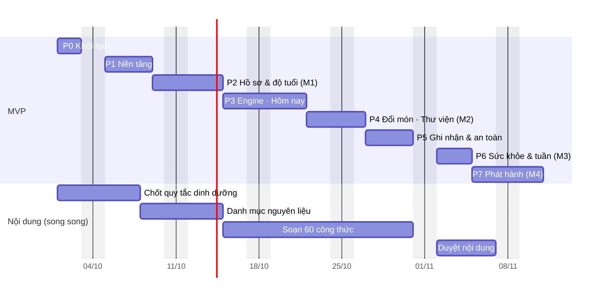

# Kế hoạch triển khai — App thực đơn ăn dặm

| Mục | Nội dung |
|---|---|
| Phiên bản | v0.2 — 28/09/2026 |
| Căn cứ | [01-phan-tich-he-thong.md](01-phan-tich-he-thong.md) (mã FR / BR / NFR / UC / màn hình S, G tham chiếu từ tài liệu này) |
| Stack | Frontend **ReactJS 19 + Vite 8** · Backend **NestJS 12 (Hexagonal, ESM)** · ORM **Prisma 7** · DB **PostgreSQL 16** · Test **Vitest 5** (coverage 100% line) |
| Giả định nguồn lực | 1 backend dev + 1 frontend dev full-time; 1 chuyên gia dinh dưỡng bán thời gian cho nội dung |
| Ước lượng | Ngày công (dev-day), mang tính định hướng, ±30% |

---

## 1. Định nghĩa MVP

**Mục tiêu MVP:** Phụ huynh đăng ký tài khoản, tạo hồ sơ bé, nhận thực đơn ngày/tuần an toàn theo tuổi và thực phẩm cần tránh, xem công thức, đổi món, ghi nhận bữa ăn/phản ứng; hệ thống tự tạm dừng nguyên liệu nghi ngờ. Dữ liệu lưu trên server, dùng được trên nhiều thiết bị.

| Trong MVP | Ngoài MVP (phase sau) |
|---|---|
| 10 màn hình trong thiết kế (S01–S10) | Danh sách đi chợ (G05) |
| Onboarding đủ 5 bước (G01) | Chế độ nấu từng bước (G07) |
| Đăng ký / đăng nhập / quên mật khẩu, đồng ý xử lý dữ liệu, cài đặt tài khoản (G10–G12) | Nhiều hồ sơ bé trên UI (G04) — API & DB đã hỗ trợ |
| Trang Hồ sơ bé (G03) + xác nhận dùng lại nguyên liệu (G08) | Nhiều người chăm cùng 1 bé, đăng nhập Google/Apple |
| Nhật ký tối giản (G02): timeline, không xuất file | Nhắc giờ ăn / nhắc theo dõi món mới |
| Chi tiết ngày (G09), Lên tuần sau (G06) | Tùy chỉnh giờ bữa · Xuất nhật ký PDF |
| Menu engine ở backend, catalog ~60 món seed từ JSON | CMS biên soạn/duyệt nội dung |
| PWA: cài lên màn hình chính, xem offline thực đơn hôm nay | Ghi dữ liệu khi offline (đồng bộ sau) |

---

## 2. Cách làm việc

- **Vertical slice:** mỗi phase giao 1 nhóm tính năng hoàn chỉnh từ DB → API → UI.
- **Contract-first:** ngày đầu mỗi phase, BE chốt DTO + controller stub → sinh OpenAPI → `packages/api-client` (orval) + handler MSW. FE làm UI trên mock trong khi BE hiện thực domain/use case; cuối phase bỏ mock, chạy với API thật.
- **Hexagonal từ ngày đầu:** mỗi module theo khuôn mục 7.4.3 tài liệu phân tích; có generator (plop) tạo sẵn khung `domain / application / adapters` để giảm boilerplate.
- **Nhánh & review:** trunk-based, PR nhỏ, CI bắt buộc xanh; migration Prisma phải được review riêng.

---

## 3. Lộ trình tổng quan

| Phase | Tên | BE | FE | Lịch (song song) | Mốc |
|---|---|---|---|---|---|
| P0 | Khởi tạo monorepo & hạ tầng | 2 | 1 | 2 ngày | |
| P1 | Nền tảng: Identity, Catalog, Design system | 4 | 4 | 4 ngày | |
| P2 | Hồ sơ bé & Độ tuổi | 3 | 4 | 4 ngày | **M1** |
| P3 | Menu engine · Hôm nay · Công thức | 5 | 4 | 5 ngày | |
| P4 | Đổi món & Thư viện món | 3 | 3 | 3 ngày | **M2** |
| P5 | Ghi nhận, phản ứng & an toàn | 4 | 3 | 4 ngày | |
| P6 | Sức khỏe & Thực đơn tuần | 3 | 3 | 3 ngày | **M3** |
| P7 | Hoàn thiện, bảo mật & phát hành | 4 | 3 | 4 ngày | **M4** |
| | **Tổng MVP** | **28** | **25** | **~29 ngày (~6 tuần)** | |

> Nếu chỉ có 1 dev fullstack: ~53 ngày công (~11 tuần).

| Mốc | Nội dung demo |
|---|---|
| M1 | Đăng ký → onboarding 5 bước → hồ sơ + tuổi/giai đoạn đúng, dữ liệu trên PostgreSQL |
| M2 | Luồng chính: hôm nay → công thức → đổi món → thư viện (demo với 2–3 phụ huynh) |
| M3 | Đủ tính năng MVP (feature complete) trên staging |
| M4 | Production, nội dung đã duyệt, test & bảo mật đạt |

**Đường găng:** P1 (schema + identity) → P3 (menu engine) chặn P4–P6. **Rủi ro lớn nhất ngoài code:** 60 công thức đã duyệt phải xong trước P7.

---

## 4. Chi tiết từng phase — MVP

### P0 — Khởi tạo monorepo & hạ tầng (BE 2 · FE 1) — ✅ Hoàn thành 28/09/2026

**Mục tiêu:** Repo chạy được end-to-end rỗng: web gọi được `GET /api/v1/health`.

**Chung**
- [x] `git init`, npm workspaces: `apps/web`, `apps/api`, `packages/api-client`; file thiết kế chuyển vào `design/`.
- [x] ESLint 10 (flat config) + typescript-eslint + Prettier ở gốc repo (không tách `packages/config` — chưa cần).
- [x] `docker-compose.yml`: `postgres:16-alpine` (cổng 5433, volume, healthcheck), `mailpit`.
- [x] `.env.example` cho api; `README.md` hướng dẫn chạy local.
- [x] GitHub Actions: `quality` (format, lint, typecheck) · `test` (coverage 100%, Testcontainers) · `contract` (OpenAPI + client sinh ra không lệch) · `build`.

**Backend**
- [x] NestJS 12 (ESM, `nodenext`) — khung hexagonal: `shared/kernel` (`DomainError`), `shared/infrastructure` (config, Prisma, HTTP), `modules/health` (port → use case → adapter Prisma + controller).
- [x] Prisma 7: `prisma.config.ts`, generator `prisma-client` (ESM) + `@prisma/adapter-pg`; schema v1 đầy đủ (chưa tạo migration — P1).
- [x] Validate env bằng Zod qua provider `ENV` tự viết (**thay** `@nestjs/config`: giá trị được đọc mỗi lần khởi tạo app nên test đổi env được).
- [x] `nestjs-pino` (redact header nhạy cảm), `helmet`, CORS allowlist, `ValidationPipe` (whitelist), filter lỗi RFC 9457; `AppExpressAdapter` giữ nguyên lỗi body-parser để trả `MALFORMED_JSON` / `PAYLOAD_TOO_LARGE`.
- [x] `@nestjs/swagger` tại `/api/docs` (tắt ở production), `openapi:export` ghi `apps/api/openapi.json`.
- [x] `eslint-plugin-boundaries` v7 theo mục 7.4.6 + test kiến trúc chạy ESLint thật trên file giả lập (TC-ARC-001/002).
- [x] Vitest 5: 3 project `unit` / `integration` / `e2e` (Testcontainers PostgreSQL), coverage v8 **100% line**. Không cần `unplugin-swc` vì mọi DI dùng `@Inject()` tường minh.
- [x] `GET /api/v1/health` (ping DB, 503 khi DB mất).
- [ ] ➜ P1: nối `@nestjs-cls/transactional` (đã cài) khi có use case ghi dữ liệu đầu tiên.
- [ ] ➜ P1: generator `plop module <name>` (làm khi tạo module thứ 2 để rút khuôn từ code thật).

**Frontend**
- [x] React 19 + Vite 8 (tạo tay, không dùng template), TanStack Query, MSW, Testing Library; trang P0 hiển thị trạng thái máy chủ (đang kiểm tra / hoạt động / sự cố / mất mạng + Thử lại).
- [x] `orval` sinh `packages/api-client` (hook TanStack Query, kiểu lỗi `ApiError`) từ `apps/api/openapi.json`; mutator `apiFetch` chuyển Problem Details → `ApiError`.
- [x] Vite proxy `/api` → `localhost:3000`; `VITE_API_BASE_URL` khi API ở domain khác.
- [ ] ➜ P1: `react-router`, `zustand`, `react-hook-form`, `date-fns`, fonts, Playwright (cài khi dùng).

**Kết quả:** 86 test (API 70 · web 7 · api-client 9), **100% line** ở cả 3 workspace; lint + typecheck + build sạch; chạy thật: `docker compose up` → API `/api/v1/health` 200 → web proxy OK.

---

### P1 — Nền tảng: Identity, Catalog, Design system (BE 4 · FE 4) — ✅ Hoàn thành 28/09/2026

**Phạm vi:** UC-18, UC-19 · FR-100..106 · G10, G11 · NFR-016..018.

**Backend**
- [x] **Prisma schema v1 đầy đủ** (mọi bảng MVP) + migration `init`; SQL viết tay: unique `lower(email)`, CHECK (`liking`, `weeks_early`, `stage_override`, giờ bữa `HH:mm`, tên bé, ngày sức khỏe), partial unique `paused_ingredients`, `pg_trgm` + GIN. Migration thứ 2 thêm nhóm `seasoning` (muối, đường, nước mắm, mật ong không tính vào 4 nhóm chất).
- [x] Module **identity** (hexagonal đủ 3 tầng): domain `User`, `Email`, chính sách mật khẩu (NFC, đếm theo code point, deny-list), `RefreshToken` (family), `PasswordResetToken`, `LoginThrottle`; 10 use case (đăng ký kèm consent, đăng nhập, refresh, đăng xuất, quên/đặt lại mật khẩu, `/me`, xóa tài khoản, xác thực); adapter argon2id, JWT HS256 (+`jti`), token ngẫu nhiên 256-bit (chỉ lưu SHA-256), Nodemailer SMTP, 4 repository Prisma.
- [x] `UnitOfWork` (port) + `ClsUnitOfWork` (`@nestjs-cls/transactional`), `Clock`, `IdGenerator` qua port.
- [x] `AuthGuard` toàn cục + `@Public()` + `@CurrentUser()`; `ThrottlerGuard` (auth 5/phút/IP, API 120/phút — cấu hình qua env).
- [x] Module **catalog** (đọc): `GET /stages`, `GET /ingredients?q=` (bỏ dấu, `đ`→`d`, alias, trigram chịu lỗi gõ, escape `%`/`_`, tối đa 20).
- [x] `catalog/*.json`: 4 giai đoạn, 45 nguyên liệu (tag dị ứng, tuổi tối thiểu, nguy cơ hóc), 12 món từ thiết kế — **tất cả `draft`** chờ chuyên gia duyệt. `npm run catalog:validate` (BR-08 tổng quát: nguyên liệu có tuổi tối thiểu > giai đoạn nhỏ nhất của món) và `npm run db:seed` (idempotent, chỉ ghi đè khi `contentVersion` tăng, từ chối `draft` ở production).
- [ ] ➜ P2: `ChildOwnershipGuard` (làm cùng API hồ sơ bé); generator `plop module`.

**Frontend**
- [x] Design tokens + `global.css` responsive: khung fluid 320–480 px, > 480 px căn giữa; `env(safe-area-inset-*)`, `100dvh`, ô nhập 16 px, `prefers-reduced-motion`; font Be Vietnam Pro + Lora self-host (chỉ subset vietnamese/latin).
- [x] Component: `Button` (loading chặn double-tap), `Chip`, `ToggleChip`, `Switch`, `RadioCard`, `RatingScale`, `SegmentedTabs` (bàn phím WAI-ARIA), `AlertBox`, `Stepper`, `ScreenHeader`, `Disclaimer`, `TextField` (label/hint/error liên kết a11y), `Icon`, `BottomNav`, `AppShell`.
- [x] Router (React Router 8, data mode): guard `RequireAuth` / `GuestOnly` (chặn open redirect `next=`), khôi phục phiên từ cookie khi mở app, trang 404, `/privacy`, `/status`.
- [x] Auth UI: Đăng nhập, Đăng ký (khối đồng ý G11 + link chính sách), Quên / Đặt lại mật khẩu; access token chỉ trong bộ nhớ; api-client tự gắn Bearer, gặp 401 thì refresh **một lần dùng chung** rồi gửi lại.
- [x] Placeholder 5 tab (Hôm nay, Tuần, Món ăn, Nhật ký, Hồ sơ bé — có đăng xuất).
- [x] P3: `FoodGroupTags`, `MealRow`; P4: `DishCard` (component nghiệp vụ, làm cùng màn dùng chúng).
- [ ] ➜ Bỏ: trang `/_ui` — thay bằng test component + kiểm tra trên Chrome thật.
- Không dùng `zustand` / `react-hook-form`: form nhỏ, state phiên là store 30 dòng (`useSyncExternalStore`).

**Kết quả kiểm chứng:** API 348 test · web 100 test · api-client 18 test — **100% line** cả 3 workspace; lint (gồm boundaries), typecheck, build sạch; bundle JS 116 KB gzip. Chạy thật: đăng ký trên Chrome ở 320×568 → vào app, tải lại trang vẫn đăng nhập; 320 px và 844×390 không cuộn ngang, vùng chạm bottom nav 62×57 px; email đặt lại mật khẩu tới Mailpit qua SMTP.

**Lỗi thật được test phát hiện và đã sửa:**
1. Thu hồi cả family khi phát hiện dùng lại refresh token nằm trong transaction rồi ném lỗi → bị rollback, token kẻ gian vẫn dùng được. Sửa: thu hồi ngoài transaction; xoay vòng bằng `UPDATE … WHERE revoked_at IS NULL` để 2 request đồng thời chỉ 1 thắng. Fake `UnitOfWork` giờ rollback như DB thật.
2. Hai access token phát trong cùng một giây giống hệt nhau → thêm `jti`.
3. `202 Accepted` không có body làm fetcher ném lỗi JSON → xử lý mọi body rỗng.
4. `StrictMode` chạy effect 2 lần → 2 lần refresh cùng cookie bị coi là đánh cắp → refresh phía web là single-flight.

---

### P2 — Hồ sơ bé & Độ tuổi (BE 3 · FE 4) — **M1** — ✅ Hoàn thành 29/09/2026

**Phạm vi:** S06, G01, S10, G03, G12 · UC-01/02/03/19 · FR-001..011, FR-013 · BR-10..14.

**Backend — module child-profile** ✅
- [x] Domain: `ageOn` (tháng kẹp cuối tháng), `planningAge` (tuổi hiệu chỉnh), `stageForAge` (BR-11, 24 tháng 0 ngày vẫn GĐ4), aggregate `Child` (tên NFC đếm grapheme 1–30, chữ viết tắt avatar, ngày sinh không ở tương lai, 1–16 tuần sinh non, ghi chú ≤ 500, danh sách tránh khử trùng — `not_eat` thắng `dislike`, ≤ 100 nguyên liệu, override giai đoạn BR-12). Kernel `LocalDate` + ngày theo giờ Việt Nam.
- [x] `ChildProfileService` (tạo/xem/danh sách/sửa/danh sách tránh/xem trước/xóa), mọi thao tác theo chủ sở hữu (không phải chủ → 404).
- [x] Adapter: `PrismaChildRepository` (lọc theo `userId` ở mọi truy vấn — phòng thủ 2 lớp, thay cho `ChildOwnershipGuard`), `CatalogIngredientLookup` (đi qua port của catalog, không đọc bảng của module khác — luật boundaries bắt được lần nối dây sai đầu tiên).
- [x] API `/children`, `/children/:id` (UUID v4), `PATCH`, `PUT …/avoid-list`, `GET …/stage-preview`, `DELETE`.
- [x] Đa tab: token vừa xoay vòng được dùng lại trong 10 giây nếu chuỗi token còn sống (TC-AUTH-025/029); dùng lại muộn hơn vẫn bị coi là đánh cắp; đăng xuất đồng thời không làm sống lại phiên. Migration `rotated_at`.
- [x] JWT kiểm tra hạn theo `Clock` của app (trước đó dùng đồng hồ hệ thống — lệch khi đồng hồ app khác).

**Frontend** ✅
- [x] Guard `RequireChild` (chưa có hồ sơ → onboarding) / `RequireNoChild`; hồ sơ bé truyền qua context để trang con không đọc danh sách vừa bị xóa.
- [x] Onboarding 5 bước (tên → ngày sinh/sinh non → S06 thực phẩm tránh + phản ứng → chi tiết phản ứng (chỉ khi “Có”) → tóm tắt), nháp trong `sessionStorage` (chịu được chế độ riêng tư), chặn deep link khi thiếu dữ liệu, lỗi từ server dẫn về đúng bước để sửa.
- [x] `AvoidFoodsEditor` dùng chung (9 chất dị ứng, tìm nguyên liệu có debounce, đổi lý do, bỏ).
- [x] S10 Độ tuổi & giai đoạn (xem trước trực tiếp qua `stage-preview`, override + “Về theo tuổi”, thực đơn sẽ áp dụng, trường hợp < 6 tháng).
- [x] G03 Hồ sơ bé (tóm tắt tuổi/giai đoạn, sửa thực phẩm tránh, xóa dữ liệu bé 2 bước), G12 Tài khoản (đăng xuất, xóa tài khoản bằng mật khẩu; xóa cache khi rời phiên).
- [x] S10 hiện “Đang cập nhật…” khi bản xem trước đang tải: nghi vấn “tắt sinh non không đổi tuổi” trên Chrome hóa ra là response chậm do máy quá tải (API đúng — có test e2e `isPremature=false`), nhưng màn hình cũ không báo đang cập nhật.

**Kết quả kiểm chứng:** API 526 test · web 170 test · api-client 18 test (714) — 100% line; domain 100% branch; lint + typecheck sạch. Chạy thật ở 390 px: đăng ký → onboarding đủ 5 bước (tìm “muop” ra “Mướp đắng”) → hồ sơ hiển thị đúng tuổi hiệu chỉnh theo ngày thật.

**Lỗi thật được phát hiện và đã sửa trong P2:** refresh đồng thời/đa tab bị đăng xuất; đăng xuất đồng thời có thể làm sống lại phiên; JWT kiểm tra hạn bằng đồng hồ hệ thống; trang con crash sau khi xóa hồ sơ bé; hồ sơ hiện “Chưa đến tuổi ăn dặm” khi dữ liệu giai đoạn chưa tải xong; ô tìm báo “không tìm thấy” khi kết quả chỉ là món đã thêm; case trùng nguyên liệu theo thứ tự `not_eat` → `dislike` chưa được test (cổng 100% branch phát hiện).

---

### P3 — Menu engine · Thực đơn hôm nay · Công thức (BE 5 · FE 4) — ✅ Hoàn thành 07/10/2026

**Phạm vi:** S01, S03 · UC-04/05/16 · FR-020..030, FR-032 · BR-01..08, BR-13..15, BR-20..26, BR-30..31.

**Backend** — module **meal-planning** ✅
- [x] Domain `SafetyFilter` (BR-01..07) trả lý do loại theo thứ tự ưu tiên `allergen > avoid > paused > age > refused > sick_new`; mỗi BR 1 test âm tính + property-based test (fast-check): không món nào vi phạm avoid list lọt qua.
- [x] Domain `MenuEngine.generateDay` theo pipeline mục 7.7 (lọc cứng → slot → chống lặp 7 ngày, nới 3 ngày khi < 3 ứng viên → chấm điểm → tie-break FNV-1a ổn định → mã lý do). Trọng số là hằng số trong `menu-engine.ts` (chưa tách `engine.config.ts` — chỉ một chỗ dùng). `generateWeek` chuyển sang P6: thực đơn được lập theo từng ngày khi mở (hôm nay → +13 ngày).
- [x] Test engine: không lặp món 7 ngày khi kho đủ; bữa chính khác nguồn đạm; ≤ 1 nguyên liệu mới có tag dị ứng/ngày ở Sáng/Trưa, cách ≥ 3 ngày; cùng input → cùng output. Benchmark 7 ngày × 200 món ≤ 200 ms tách thành project `perf` (`npm run test:perf`, bước riêng trong CI) — chạy kèm coverage thì số đo vô nghĩa.
- [x] `PlannedMeal` (`markPrepared`, lỗi `MealAlreadyLogged`). `replaceDish` chuyển sang P4 cùng đổi món.
- [x] Ports out: `MealPlanRepository`, `PlanningCatalog`, `ChildPlanningReader` (adapter gọi `ChildProfileService`), `FoodHistoryReader` (đọc thẳng bảng `exposures`, `paused_ingredients`, `meal_logs`, `health_episodes` cho tới khi P5/P6 có module riêng), `Clock`.
- [x] Use cases: `DayPlanService.getDay` (tự lập + lưu, trả `nextMealId` theo BR-30), `markPrepared`, `RecipeService` (biến thể giai đoạn, cờ lần đầu, chất gây dị ứng, lý do loại), `RegenerateFutureService` (BR-31) + listener `ProfileChanged` qua `EventBus` in-process.
- [x] Endpoint: `GET /children/:id/days/:date`, `PATCH /meals/:mealId`, `GET /children/:id/dishes/:dishId?stage=`.
- [x] Integration: `UNIQUE(child_id, date, slot)` chống lập trùng khi 2 request đồng thời (bắt P2002 → đọc lại).

**Frontend** ✅
- [x] **S01**: header (avatar, “Thứ Năm, 24 tháng 9”, tên, tuổi · giai đoạn); chip kết cấu → S10, sức khỏe → S09, tránh (2 tên + “+N”); card bữa tiếp theo (đếm ngược làm tròn lên phút, cập nhật 15 s, tự sang ngày mới lúc 0 giờ giờ VN), meta, `FoodGroupTags` + “Đạt x/4 nhóm” (bữa phụ không chấm), `AlertBox` lần đầu thử, 4 hành động; `MealRow` với trạng thái; slot chưa có món an toàn; trạng thái cuối ngày; bé ngoài 6–24 tháng; disclaimer.
- [x] “Đã chuẩn bị xong” → `PATCH` optimistic, hoàn tác + báo lỗi nếu bữa đã được ghi ở máy khác; sau đó “Bé đã ăn” thành nút chính.
- [x] **S03**: ảnh placeholder theo loại món, nhãn duyệt/version (“Chưa được chuyên gia duyệt” cho món nháp), meta 4 ô, `SegmentedTabs` theo độ tuổi (mặc định giai đoạn bé, giữ nội dung cũ khi tải tab mới), nguyên liệu 1 phần + nhóm màu + “lần đầu”, lưu ý an toàn, các bước, “Đổi món” (khi mở từ bữa), “Bắt đầu nấu” cuộn tới các bước và chuyển focus (không animate khi `prefers-reduced-motion`).
- [x] Route tạm cho màn của phase sau đã có link từ S01: `/meals/:id/swap` (P4), `/meals/:id/log` (P5), `/health` (P6).
- [ ] ➜ P4: bảng dịch mã giải thích engine → câu tiếng Việt. API P3 chưa trả mã lý do (chỉ S02 dùng), nên làm cùng `swap-suggestions`.

**Nghiệm thu:** Bé Na GĐ2 → hôm nay 3 bữa chính + 1 bữa phụ lúc 07:30/11:00/15:00/18:00, không món nào có trứng; sửa avoid list thêm “Cá” → các bữa tương lai có cá được thay, bữa đã qua giữ nguyên; công thức mở từ bữa hiện đúng khẩu phần GĐ2. ✅ (e2e `meal-planning.e2e-spec.ts` + chạy thật)

**Kết quả kiểm chứng:** API 663 test · web 230 test · api-client 18 test (911) — 100% line cả 3 workspace; domain 100% branch; lint (gồm boundaries) + typecheck sạch; perf 7 ngày × 200 món ≈ 15 ms sau warm-up. Chạy thật trên Chrome 390 px và 320 px: thực đơn hôm nay lập từ API thật, “Đã chuẩn bị xong” → “Bé đã ăn”, mở công thức → đổi tab 10–12 tháng → “Bắt đầu nấu”; không cuộn ngang, mọi vùng chạm ≥ 44 px.

**Lỗi thật được phát hiện và đã sửa trong P3:** `generateDay` dựng lại tập món đã dùng cho từng món ứng viên (O(n²), 406 ms cho 200 món — sửa còn ~15 ms); seeder catalog chạy ~100 câu lệnh trong một transaction tương tác với hạn mặc định 5 s, máy bận là hỏng (nâng lên 120 s); kiểu `DomainEvent` có index signature làm mất kiểm tra kiểu của payload (đổi sang `publish<E extends DomainEvent>`); adapter đọc hồ sơ bé và repository bữa ăn chưa có test cho lỗi khác “không tìm thấy”/“trùng slot” (cổng 100% line phát hiện).

---

### P4 — Đổi món & Thư viện món (BE 3 · FE 3) — **M2** — ✅ Hoàn thành 07/10/2026 (trừ demo)

**Phạm vi:** S02, S05 · UC-06/07 · FR-040..051 · BR-21, BR-27..29.

**Backend** ✅
- [x] Tách bước xếp hạng từng slot của engine thành `rankSlot` (lọc loại bữa + quy tắc dị ứng mới → chống lặp 7/3 ngày → chấm điểm → thứ tự ổn định), dùng chung cho `generateDay` và đổi món — cùng quy tắc, không chép code.
- [x] Domain `suggestSwaps`: lý do đổi lọc trước cửa sổ chống lặp (BR-27 nhanh hơn + điểm thưởng theo phút tiết kiệm; BR-28/29 loại món chung **nguyên liệu chính** `isMain`); tối đa 5 món, `reasons` ≤ 3 theo thứ tự hiển thị; `excluded.byReason` đếm trên món cùng loại; `relaxedWindowDays`; `repeatInDays` cho món trùng trong tuần.
- [x] Domain `filterLibrary`: chip (đạm / bữa phụ), `fresh`, tag Lần đầu / Bé thích / Ăn N ngày trước, `hidden` chỉ tính món khớp từ khóa và chip. Tìm kiếm: ưu tiên từ có dấu khi người dùng gõ dấu (“bò” ≠ “bơ”), rồi từ nguyên vẹn không dấu (“gà” ≠ “gạo”), cuối cùng tiền tố cho từ đang gõ. `toSearchText` chuyển về `shared/kernel`.
- [x] `PlannedMeal.swapTo` (bữa đã ghi → `MEAL_ALREADY_LOGGED`, trùng món → `SAME_DISH`, bữa `prepared` về `planned`); `SwapService` (`MEAL_IN_PAST`, `DISH_NOT_FOR_SLOT`, `DISH_NOT_SAFE_FOR_CHILD` — lọc cứng kiểm lại phía server; lưu bữa + `swap_events` trong một transaction); `LibraryService`.
- [x] Endpoint: `GET /meals/:id/swap-suggestions?reason=`, `POST /meals/:id/swap`, `GET /children/:id/dishes?q=&chip=&fresh=`.
- [x] Quyết định: `POST swap` chỉ kiểm lọc cứng + loại bữa, **không** kiểm BR-24/25 (gợi ý đã tuân thủ; phụ huynh chủ động chọn món khác vẫn được phép). Tín hiệu “Bé không thích” = `swap_events.reason = disliked`.

**Frontend** ✅
- [x] Bảng dịch mã lý do engine → câu tiếng Việt (`explain.ts`), gồm “Đạm bò — khác nguồn đạm bữa tối (gà)” từ `otherMains`.
- [x] **S02**: lý do (single-select, giữ danh sách cũ + “Đang cập nhật…” khi đổi lý do), card “Phù hợp nhất” + lý do, ứng viên khác (Nhanh hơn N phút), ghi chú nới cửa sổ theo từng món, tóm tắt món bị loại + “Bộ lọc an toàn không bao giờ được nới”; Chọn → mutation (khóa mọi nút khi đang gửi) → làm mới dữ liệu của bé → quay lại; bị từ chối → báo lỗi + tải lại gợi ý; trạng thái rỗng (kể cả “không có món nhanh hơn”), bữa không đổi được (đã ghi / quá khứ / không tồn tại).
- [x] **S05**: dòng mô tả bộ lọc, ô tìm (debounce 150 ms, đồng bộ `?q=`), chip + `?chip=`, switch “Chưa ăn 7 ngày” luôn hiển thị (`?fresh=1`), lưới `DishCard` tô màu theo nguồn đạm, empty state + nút bỏ lọc, khối “Đang ẩn N món” mở danh sách + lý do. Không có số đếm trên từng chip (thiết kế không có).
- [ ] **Demo M2** với 2–3 phụ huynh — cần người dùng thật, chưa làm.

**Nghiệm thu:** S02 tái hiện bằng dữ liệu kiểm thử đúng thiết kế (bò cải bó xôi phù hợp nhất + 3 lý do; “Đã loại 6 món: 3 chứa trứng, 2 chưa hợp độ tuổi, 1 bé từng từ chối”). Với catalog dev 12 món (chưa có món trứng), chạy thật cho ra gợi ý hợp lệ và đếm đúng món bị loại; con số giống hệt thiết kế cần catalog ≥ 60 món (P7).

**Kết quả kiểm chứng:** API 757 test · web 279 test · api-client 18 test — 100% line cả 3 workspace; domain 100% line + branch; lint + typecheck sạch. Chạy thật trên Chrome 390 px và 320 px: đổi bữa sáng từ S01 → chọn “Phù hợp nhất” → S01 hiện món mới ngay; S05 tìm “bơ” chỉ ra “Bơ chuối nghiền”; không cuộn ngang, vùng chạm ≥ 44 px.

**Lỗi thật được phát hiện và đã sửa trong P4:** tìm không dấu “gà bí” khớp mọi món có “gạo” (ga ⊂ gao); “bò” khớp cả “bơ” và “bó”; switch “Chưa ăn 7 ngày” chỉ hiện sau khi tải xong (không bấm được khi đang tải); track của `Switch` chỉ cao 32 px (< 44 px, ảnh hưởng cả onboarding); thông báo `MEAL_ALREADY_LOGGED` nói “không thể đổi trạng thái” — sai ngữ cảnh khi đổi món; một lần chạy coverage bị treo khi chạy song song với lần chạy e2e riêng (chạy lại tuần tự thì sạch).

---

### P5 — Ghi nhận bữa ăn, phản ứng & an toàn (BE 4 · FE 3)

**Phạm vi:** S07, S08, G08, G02 · UC-08/09/10/14/17 · FR-060..069 · BR-40..44.

**Backend**
- [ ] Module **meal-log**: domain `MealLog` (+ `Reaction`), quy tắc xác định nguyên liệu nghi ngờ (BR-40), cập nhật `IngredientExposure` (BR-44); use cases `LogMeal` (`@Transactional`), `GetJournal` (cursor pagination); endpoint `POST /meals/:id/log`, `GET /children/:id/journal`.
- [ ] Module **safety**: domain `PausedIngredient`, `UrgentEvent`; use cases `PauseIngredients`, `ResumeIngredient` (BR-42), `PreviewUrgent`, `OpenUrgentEvent` (BR-41), `MarkContactedMedical`, `ListPaused`; phát `IngredientsPaused` / `IngredientResumed`.
- [ ] Nối `SafetyReader` thật cho meal-planning; handler `IngredientsPaused`/`IngredientResumed` → `RegenerateFuture` **trong cùng transaction** với `LogMeal` / `OpenUrgentEvent`.
- [ ] Test integration: log có “Nổi mẩn đỏ” sau bữa có rau ngót lần đầu → 1 transaction ghi log + reaction + exposure + paused + bữa tương lai được thay; lỗi giữa chừng → rollback toàn bộ.
- [ ] Log API không ghi body chứa triệu chứng/ghi chú (kiểm tra redact).

**Frontend**
- [ ] **S07**: giờ ghi nhận (mặc định hiện tại, sửa được), lượng ăn 6 mức, rating 1–5 (“Từ chối / Rất thích”), phần phản ứng (mở sẵn khi `?focus=reaction`), 6 triệu chứng, 4 mức độ, ghi chú ≤ 500 ký tự, câu thông báo nguyên liệu sẽ tạm dừng; banner đỏ khi chọn Khó thở / Sưng môi mặt / Nặng; link S08 giữ nháp.
- [ ] Sau khi lưu: hiển thị tên nguyên liệu đã tạm dừng (từ response), invalidate `days`, `dishes`, `journal`.
- [ ] **S08**: danh sách dấu hiệu, `tel:115` (nút lớn + số hiển thị dạng text), nguyên liệu tạm dừng (từ `urgent-preview`, ghi khi mở màn), “Tôi đã liên hệ nhân viên y tế” → `PATCH`.
- [ ] **G08** trong Hồ sơ: danh sách nguyên liệu tạm dừng + “Bác sĩ đã cho phép dùng lại” (xác nhận 2 bước).
- [ ] **G02** Nhật ký: timeline theo ngày, phản ứng nổi bật màu đỏ, sự kiện khẩn cấp, cuộn vô hạn.

**Nghiệm thu:** Tái hiện kịch bản S07 → S08; sau đó rau ngót không xuất hiện ở bữa tương lai, gợi ý đổi món, thư viện (nằm trong khối “Đang ẩn”); dùng lại → xuất hiện trở lại.

---

### P6 — Sức khỏe & Thực đơn tuần (BE 3 · FE 3) — **M3**

**Phạm vi:** S09, S04, G06, G09 · UC-11/12/13 · FR-080..084, FR-090..095 · BR-50..53, BR-60..62.

**Backend**
- [ ] Module **health**: domain `HealthEpisode` (chuyển trạng thái, ngày kết thúc ≥ bắt đầu), `HealthAdjustment` (BR-50..53 → thêm bữa phụ, hệ số khẩu phần, giảm kết cấu, chặn nguyên liệu mới); use cases `GetCurrentHealth`, `PreviewHealthChange`, `UpdateHealth` → `HealthChanged`.
- [ ] Engine đọc `health` qua `ChildContextReader`; handler `HealthChanged` → `RegenerateFuture`.
- [ ] Domain `MenuEngine.weekStats` (BR-60..62); use cases `GetWeek`, `GenerateWeek` (`overwrite` chỉ thay bữa chưa ghi nhận).
- [ ] Endpoint: `/children/:id/health*`, `GET /children/:id/weeks/:weekStart`, `POST …/generate`.

**Frontend**
- [ ] **S09**: 3 `RadioCard`, 6 biểu hiện, ngày bắt đầu / dự kiến kết thúc, khối “Thực đơn sẽ thay đổi” (từ `health/preview`), link S08, Cập nhật thực đơn.
- [ ] Banner trên S01 khi qua ngày dự kiến kết thúc: gợi ý chuyển “Đang hồi phục” / “Bình thường”.
- [ ] **S04**: “Tuần 21–27/9”, tuần trước/sau (`?start=`), 2 thẻ chỉ số, thanh xoay vòng đạm (nguồn bị tránh = 0 + chú thích), 7 dòng ngày (Hôm nay nổi bật, x/4, “kế hoạch”, “mới”), câu “không phải điểm đánh giá”.
- [ ] **G09** `/week/:date`: tái dùng danh sách bữa S01, đổi món cho ngày tương lai.
- [ ] **G06** Lên thực đơn tuần sau: xác nhận ghi đè nếu đã có → chuyển sang tuần mới.
- [ ] Nút *Danh sách đi chợ*: ẩn ở MVP (hoặc “Sắp ra mắt” — PO quyết định).

**Nghiệm thu:** Chọn “Đang ốm” → bữa tương lai mềm hơn 1 mức, không nguyên liệu mới, thêm bữa phụ; chỉ số tuần khớp dữ liệu đã ghi nhận; mọi FR High của MVP ở trạng thái Implemented trên staging.

---

### P7 — Hoàn thiện, bảo mật & phát hành (BE 4 · FE 3) — **M4**

**Backend / hạ tầng**
- [ ] Staging + production: API container (≥ 2 instance), PostgreSQL managed (backup hằng ngày, PITR), `prisma migrate deploy` là bước riêng trong pipeline.
- [ ] Sentry, health check, cảnh báo uptime (NFR-006); diễn tập khôi phục backup (NFR-007).
- [ ] Load test k6: 200 user đồng thời, đo p95 (NFR-002, 003, 005).
- [ ] Rà soát bảo mật: e2e truy cập chéo cho **mọi** route có `:childId`/`:mealId` (NFR-017), throttle, cookie flags, HSTS, CORS, dependency audit; checklist OWASP ASVS L1.
- [ ] Job xóa cứng tài khoản sau 30 ngày (UC-19).
- [ ] Thay seed `draft` bằng **catalog đã duyệt** (~60 món, ~80 nguyên liệu); production từ chối món `draft`.

**Frontend**
- [ ] PWA: manifest (theme `#4F6B4A`, nền `#F6F1E8`, icon), precache shell + font; persist cache TanStack Query để xem offline (NFR-008); báo rõ khi thao tác ghi cần mạng.
- [ ] Playwright (WebKit + Chromium) cho 5 luồng NFR-011 trên 7 viewport của NFR-014, chạy với API + DB thật trong CI; assert không cuộn ngang + screenshot so sánh.
- [ ] axe-core trên mọi route, thử VoiceOver với S01/S07/S08 (NFR-013); Lighthouse mobile ≥ 90, LCP ≤ 2.5 s, bundle ≤ 200 KB.
- [ ] Error boundary, màn lỗi mạng/phiên hết hạn thân thiện.

**Pháp lý & nội dung**
- [ ] Chính sách quyền riêng tư + điều khoản; nội dung màn đồng ý (G11) được duyệt; hồ sơ đánh giá tác động xử lý dữ liệu cá nhân (C-007); chốt nơi đặt server (Q12).
- [ ] Rà soát copy tiếng Việt + mọi disclaimer (C-005).
- [ ] UAT với 5 phụ huynh; fix toàn bộ bug blocker + major.

**Nghiệm thu phát hành:** CI xanh; 0 bug blocker/major; toàn bộ FR High = Verified; NFR High đạt; nội dung có xác nhận duyệt của chuyên gia (C-008).

---

## 5. Track nội dung (song song, do chuyên gia dinh dưỡng)

| Bước | Thời điểm | Đầu ra |
|---|---|---|
| Chốt quy tắc dinh dưỡng | Trước P3 | Q3 đã chốt cho MVP (v0.3 tài liệu phân tích); Q4–Q7 dùng giả định hiện tại; tất cả cần chuyên gia xác nhận trước P7 |
| Danh mục nguyên liệu | P1–P2 | ~80 nguyên liệu: nhóm chất, nguồn đạm, tag dị ứng, tuổi tối thiểu, nguy cơ hóc |
| Soạn công thức | P2–P5 | ~60 món theo template Google Sheet → `catalog:import` → PR vào `catalog/*.json` |
| Duyệt & ký | P6 | `reviewedBy`, `contentVersion`, `status = published` cho từng món |

---

## 6. Sau MVP (định hướng)

### P8 — MVP+ tiện ích (BE ~4 · FE ~6)
- Danh sách đi chợ (G05, FR-096): use case gộp nguyên liệu tuần theo đơn vị, tick đã mua, chia sẻ dạng text.
- Chế độ nấu (G07, FR-031): từng bước toàn màn hình, Wake Lock, hẹn giờ.
- Nhiều hồ sơ bé trên UI (G04, FR-012).
- Tùy chỉnh giờ bữa.
- Module **notification**: Web Push (VAPID), scheduler nhắc giờ ăn & nhắc theo dõi 2 giờ sau món mới (FR-097/098) — iOS cần cài PWA (16.4+).
- Xuất nhật ký PDF cho bác sĩ (FR-070).

### P9 — Gia đình & đăng nhập mạng xã hội (BE ~6 · FE ~4)
- Nhiều người chăm cùng 1 bé (FR-099): lời mời qua link, vai trò chủ/người chăm; thay `ChildOwnershipGuard` bằng kiểm tra membership.
- Đăng nhập Google / Apple.

### P10 — CMS nội dung & phân tích (BE ~6 · FE ~6)
- Module catalog có phía ghi: biên soạn, quy trình duyệt, version công thức (F16); app admin riêng.
- Analytics ẩn danh (tỷ lệ đổi món, món bị từ chối, tỷ lệ kích hoạt nới cửa sổ) để tinh chỉnh trọng số engine.

---

## 7. Rủi ro & giảm thiểu

| Rủi ro | Mức | Giảm thiểu |
|---|---|---|
| Nội dung công thức chậm / chưa duyệt | Cao | Bắt đầu track nội dung từ tuần 1; seed `draft` cho dev; production từ chối `draft`. |
| Quy tắc dinh dưỡng chưa được chuyên gia xác nhận (Q3–Q7) | Cao | Q3 đã chốt cho MVP; quy tắc gom ở domain `menu-engine.ts`/`safety-filter.ts` (mỗi quy tắc có test riêng) nên đổi được nhanh khi chuyên gia góp ý. |
| Sai sót an toàn (gợi ý món chứa chất cần tránh) | Cao | `SafetyFilter` tập trung ở domain; kiểm tra 2 lớp (engine + khi ghi); test âm tính từng BR + property-based. |
| Pháp lý dữ liệu sức khỏe trẻ em (NĐ 13) | Cao | Chốt nơi đặt server (Q12) trước P7; tối thiểu hóa dữ liệu thu thập; đồng ý có version; quyền xóa. |
| Hexagonal tăng boilerplate, chậm tiến độ | Trung bình | Generator `plop module`; chỉ tách port khi có ≥ 1 adapter thật hoặc cần fake để test; mapper đơn giản. |
| Transaction xuyên module (log → pause → regenerate) | Trung bình | `@nestjs-cls/transactional` + event handler đồng bộ; test integration rollback. |
| FE bị chặn chờ API | Trung bình | Contract-first + MSW sinh từ OpenAPI. |
| Kho món ít → lặp món | Trung bình | BR-21 + thông báo minh bạch; mục tiêu ≥ 60 món. |
| Mở app ở 2 tab cùng lúc → 2 lần refresh cùng cookie → bị coi là đánh cắp, cả 2 tab đăng xuất | Trung bình | Làm ở P2: cho phép dùng lại token vừa xoay vòng trong 10 giây (trả cùng cặp mới), hoặc khóa refresh giữa các tab bằng `BroadcastChannel`/Web Locks. |
| Hành vi `tel:` / PWA khác nhau trên iOS | Thấp | Test thiết bị thật ở P7; hiện số 115 dạng text cạnh nút. |

## 8. Definition of Done (áp dụng mọi phase)

- CI xanh: lint (gồm **boundaries hexagonal**), typecheck, unit, integration, e2e, build; **coverage 100% line** (NFR-010).
- Mỗi tính năng có test case đặc biệt (biên, lỗi, bất thường, bảo mật) theo [03-chien-luoc-kiem-thu.md](03-chien-luoc-kiem-thu.md), không chỉ luồng bình thường.
- UI kiểm ở 320 px và landscape: không cuộn ngang, nút chính không bị bàn phím ảo che (NFR-014).
- Logic nghiệp vụ nằm ở `domain`/`application`, không nằm trong controller hay repository; test đặt tên theo mã BR/FR (VD `it('BR-01 loại món có trứng khi bé tránh trứng')`).
- Migration Prisma đã review, chạy được trên DB có dữ liệu staging.
- OpenAPI được export lại và `packages/api-client` được sinh lại, không có diff chưa commit.
- UI khớp thiết kế ở 390px và co giãn đúng 320–480px; vùng chạm ≥ 44px; control có nhãn a11y; không hard-code chuỗi ngoài `strings/vi.ts`.
- Cập nhật cột Trạng thái của FR tương ứng trong tài liệu phân tích.
